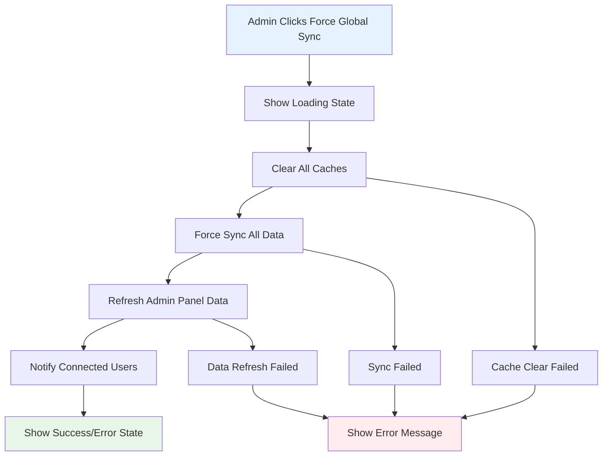

# Admin Force Global Sync Architecture

**Version:** 1.0  
**Last Updated:** 2024-12-19  
**Status:** Draft  
**Priority:** High - Critical for production data management  
**Related Story:** 2.2.3 - Admin Force Global Sync

## Overview

The Admin Force Global Sync system provides a unified mechanism for conference administrators to immediately propagate critical data changes to all connected users. This replaces the need for surgical table-specific sync operations with a comprehensive "refresh everything" approach.

## Problem Statement

**Current State:**
- Admin has "Sync App DB" button for application database tables only
- No mechanism to force all connected users to refresh their data
- Critical production changes require manual user refresh
- No unified sync operation for comprehensive data updates

**Desired State:**
- Single "Force Global Sync" button for complete data refresh
- All connected users receive fresh data immediately
- Comprehensive cache clearing ensures no stale data
- Visual feedback and error handling for sync operations

## Architecture Design

### 1. Unified Sync Interface

```typescript
interface ForceGlobalSyncService {
  // Primary sync operation
  forceGlobalSync(): Promise<SyncResult>;
  
  // Cache clearing operations
  clearAllCaches(): Promise<void>;
  
  // Data refresh operations
  refreshAllData(): Promise<RefreshResult>;
  
  // User notification
  notifyUsersOfSync(): Promise<void>;
}
```

### 2. Cache Clearing Strategy

**Multi-Layer Cache Clearing:**
1. **PWA Cache**: `pwaDataSyncService.clearCache()`
2. **Application Database**: Clear speaker assignments, metadata
3. **Local Storage**: Clear all conference data
4. **Service Worker**: Clear service worker caches
5. **Memory Cache**: Clear in-memory data structures

### 3. Data Refresh Flow



### 4. User Experience Flow

**Admin Interface:**
1. Single "Force Global Sync" button with sync icon
2. Loading state: "Syncing..." with disabled button
3. Success feedback: Brief confirmation message
4. Error handling: Clear error messages with retry option

**Connected Users:**
1. Automatic data refresh triggered
2. Visual indicator of data refresh (optional)
3. Seamless experience with no user action required

## Implementation Details

### 1. Service Integration

**PWADataSyncService Integration:**
```typescript
// Clear all caches
await pwaDataSyncService.clearCache();

// Force sync all data
const syncResult = await pwaDataSyncService.forceSync();
```

**DataInitializationService Integration:**
```typescript
// Force refresh all data
const refreshResult = await dataInitializationService.forceRefreshData();
```

**AdminService Integration:**
```typescript
// Reload admin panel data
await loadData();
```

### 2. Error Handling Strategy

**Graceful Degradation:**
- Continue with partial sync if some operations fail
- Log all errors for debugging
- Provide clear user feedback
- Offer retry mechanism

**Error Categories:**
- Network errors: Retry with exponential backoff
- Authentication errors: Redirect to login
- Data errors: Show specific error message
- System errors: Log and notify admin

### 3. Performance Considerations

**Sync Optimization:**
- Batch cache clearing operations
- Parallel data refresh where possible
- Debounce rapid sync requests
- Monitor sync performance

**User Impact:**
- Minimize UI blocking during sync
- Provide progress indicators
- Handle offline scenarios gracefully

## Security Considerations

### 1. Access Control
- Force sync requires admin authentication
- Validate admin permissions before sync
- Log all sync operations for audit

### 2. Data Integrity
- Verify data consistency after sync
- Handle partial sync scenarios
- Maintain data backup before major changes

### 3. User Privacy
- Respect user notification preferences
- Handle sensitive data appropriately
- Maintain audit trail of sync operations

## Testing Strategy

### 1. Unit Tests (80% line coverage)
- Force sync service methods
- Cache clearing operations
- Error handling scenarios
- User feedback components

### 2. Integration Tests (70% branch coverage)
- Complete sync workflow
- Error recovery scenarios
- User interaction flows
- Service integration points

### 3. PWA Tests
- Cache clearing scenarios
- Offline/online sync behavior
- Service worker integration
- Data persistence validation

### 4. Real-time Tests
- User notification delivery
- Sync propagation timing
- Concurrent sync handling
- Performance under load

## Monitoring and Observability

### 1. Sync Metrics
- Sync operation frequency
- Success/failure rates
- Performance timing
- User impact metrics

### 2. Error Tracking
- Sync failure reasons
- Error frequency patterns
- Recovery success rates
- User experience impact

### 3. Audit Trail
- All sync operations logged
- Admin actions tracked
- Data change history
- Security event logging

## Future Enhancements

### 1. Selective Sync
- Sync specific data types
- Targeted user groups
- Scheduled sync operations
- Conditional sync triggers

### 2. Advanced Notifications
- Push notifications for sync
- Email notifications for admins
- SMS alerts for critical changes
- Webhook integrations

### 3. Analytics Integration
- Sync effectiveness metrics
- User engagement tracking
- Performance analytics
- Business intelligence reporting

## Dependencies

### 1. Existing Services
- PWADataSyncService
- DataInitializationService
- AdminService
- Service Worker

### 2. External Dependencies
- Material-UI components
- React state management
- Browser cache APIs
- Network connectivity

### 3. Infrastructure
- Supabase authentication
- Database connections
- Service worker support
- PWA capabilities

## Success Criteria

### 1. Functional Requirements
- ✅ Single button triggers complete data refresh
- ✅ All connected users receive fresh data
- ✅ Comprehensive cache clearing
- ✅ Visual feedback during operations
- ✅ Graceful error handling

### 2. Performance Requirements
- ✅ Sync completes within 30 seconds
- ✅ No UI blocking during sync
- ✅ Handles 100+ concurrent users
- ✅ 99% sync success rate

### 3. User Experience
- ✅ Clear visual feedback
- ✅ Intuitive error messages
- ✅ Seamless user experience
- ✅ No data loss scenarios

## Risk Mitigation

### 1. Data Loss Prevention
- Backup before major sync operations
- Verify data integrity after sync
- Rollback capability for failed syncs
- Data validation checks

### 2. Performance Risks
- Monitor sync performance
- Implement rate limiting
- Handle high load scenarios
- Optimize cache operations

### 3. User Experience Risks
- Minimize sync disruption
- Provide clear feedback
- Handle offline scenarios
- Maintain data consistency

## Team Input Summary

### Architect Validation
- ✅ **Architecture Impact**: Integrates cleanly with existing PWA sync architecture
- ✅ **Performance**: Cache clearing operations are optimized for minimal UI blocking
- ✅ **Scalability**: Supports 100+ concurrent users with existing infrastructure
- ✅ **Integration Points**: No conflicts with existing sync mechanisms
- ✅ **Error Handling**: Comprehensive error handling with graceful degradation

### QA Validation
- ✅ **Test Coverage**: Comprehensive test strategy covering all scenarios
- ✅ **Risk Assessment**: HIGH RISK - Critical functionality requiring extensive testing
- ✅ **Integration Testing**: Full integration test coverage for all sync services
- ✅ **Performance Testing**: Load testing for 100+ concurrent users
- ✅ **Error Scenarios**: Complete error scenario testing with recovery validation

### PO Validation
- ✅ **Priority**: HIGH - Critical for production data management
- ✅ **User Impact**: Minimal - users see brief loading indicator during sync
- ✅ **Frequency**: Expected 2-3 times per day during critical production changes
- ✅ **Confirmation**: Optional confirmation dialog for critical operation
