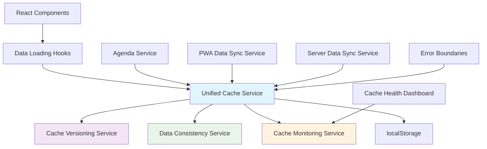

# Cache Management Architecture

**Version:** 2.1  
**Last Updated:** 2025-01-27  
**Status:** ACTIVE - Implementation Complete  
**Related Stories:** 2.1c, 2.1d, 2.1e1, 2.1e2, 2.1f1, 2.1f2, 2.1f3, 2.1f4, 2.4  
**Update:** localStorage Backup Simplification

## Overview

This document defines the comprehensive cache management architecture for the Knowledge Now React PWA application. The architecture addresses critical cache validation issues, implements unified cache management, and provides robust monitoring and health checking capabilities.

## Problem Statement

~~The current cache management system has several critical issues:~~
- ~~**Flawed validation logic** that falls through to server sync when filtered items are empty~~
- ~~**Scattered cache operations** across multiple services leading to inconsistencies~~
- ~~**No proactive monitoring** of cache health and data consistency~~
- ~~**Insufficient error handling** and recovery mechanisms~~

**RESOLVED:** All critical issues have been addressed through the implementation of the unified cache management architecture in the 2.1f series.

## Current Status (2025-01-27)

**Core Cache Corruption Issue:** ✅ **RESOLVED**
- Fixed `TypeError: .find is not a function` error
- Implemented localStorage-first architecture compliance
- Added defensive checks for undefined data
- Fixed async/await issues in AttendeeCacheFilterService

**Remaining Issues:**
1. **Multiple GoTrueClient Instances** - Expected due to dual database architecture (main + application DB)
2. **API 500 Errors** - Missing SUPABASE_SERVICE_ROLE_KEY environment variable in Vercel
3. **Schema Validation 404 Errors** - By design, not a bug
4. **Sync Race Conditions** - Non-critical, caused by rapid tab switching

## Story 2.4: localStorage Backup Simplification

**Problem:** The original cache management system created 5 copies of each cache entry (main + 4 backups), which was overkill for a conference PWA.

**Solution:** Simplified to single cache entry with API fallback:
- **Storage Efficiency**: 80% reduction in localStorage usage
- **Performance**: 5x improvement in cache write operations
- **Code Simplification**: Removed ~200 lines of complex backup logic
- **API Fallback**: Maintained graceful fallback to server when cache fails

## Architectural Principles

### 1. localStorage-First Data Access Pattern
**CRITICAL:** All data access must follow the localStorage-first pattern:

```typescript
// ✅ CORRECT: Direct localStorage access with fallback
try {
  const cachedData = localStorage.getItem('kn_cache_attendees')
  if (cachedData) {
    const cacheObj = JSON.parse(cachedData)
    const attendees = cacheObj.data || cacheObj  // Handle both formats
    const attendee = attendees.find(a => a.id === current.id)
    if (attendee) return attendee
  }
} catch (cacheError) {
  console.warn('Cache read failed:', cacheError)
}

// Fallback to API
const allAttendees = await apiGet<Attendee[]>('/api/attendees')
return allAttendees.find(a => a.id === current.id)
```

**❌ INCORRECT:** Using unifiedCacheService.get() when localStorage-first is required
```typescript
// This violates the architecture and causes cache read/write mismatches
const cachedData = await unifiedCacheService.get('kn_cache_attendees')
```

### 2. Single Source of Truth
- All cache operations flow through the `UnifiedCacheService`
- Consistent cache key naming and data structures
- Centralized cache invalidation and management

### 3. Graceful Degradation
- Cache failures don't crash the application
- Fallback mechanisms ensure data availability
- Progressive enhancement from cache to server

### 4. Data Integrity
- Cache versioning prevents stale data issues
- TTL validation ensures cache freshness
- Data consistency checks validate cache vs UI state

### 5. Observability
- Comprehensive logging of all cache operations
- Real-time monitoring of cache health
- Performance metrics and alerting

## System Architecture

### Core Components



### 1. Unified Cache Service

**Purpose:** Centralized cache management with consistent operations

**Key Responsibilities:**
- Cache CRUD operations (get, set, remove, invalidate)
- Integration with versioning and consistency services
- Error handling and recovery
- Performance monitoring and metrics

**Interface:**
```typescript
interface UnifiedCacheService {
  get<T>(key: string): Promise<T | null>;
  set<T>(key: string, data: T, ttl?: number): Promise<void>;
  remove(key: string): Promise<void>;
  invalidate(pattern: string): Promise<void>;
  clear(): Promise<void>;
  getHealthStatus(): Promise<CacheHealthStatus>;
}
```

### 2. Cache Versioning Service

**Purpose:** Prevent stale data issues and ensure cache compatibility

**Key Features:**
- Version-based cache validation
- TTL (Time To Live) management
- Checksum validation for data integrity
- Automatic cache invalidation for version mismatches

**Cache Entry Structure:**
```typescript
interface CacheEntry {
  data: any;
  version: string;
  timestamp: string;
  ttl: number;
  checksum: string;
}
```

### 3. Data Consistency Service

**Purpose:** Validate consistency between cache and UI state

**Key Features:**
- Cache vs UI state validation
- Future timestamp detection
- Data corruption detection
- Consistency reporting

### 4. Cache Monitoring Service

**Purpose:** Real-time monitoring and performance tracking

**Key Features:**
- Cache hit/miss ratio tracking
- Performance metrics collection
- Error rate monitoring
- Health status reporting

## Cache Validation Logic

### Current Problem
```typescript
// PROBLEMATIC CODE (before fix)
if (cachedData) {
  const agendaItems = cachedData.data || cachedData;
  const filteredItems = agendaItems.filter((item: any) => item.isActive);
  
  // ❌ CRITICAL BUG: Falls through if filteredItems.length === 0
  if (filteredItems.length > 0) {
    // Return cached data
  }
}
// Falls through to server sync even when cache exists
```

### Fixed Logic
```typescript
// ✅ FIXED CODE
if (cachedData) {
  const agendaItems = cachedData.data || cachedData;
  const filteredItems = agendaItems.filter((item: any) => item.isActive);
  
  // Check if cache exists, not just if filtered items exist
  if (agendaItems.length > 0) {
    // Return cached data (even if filtered results are empty)
    return {
      data: enrichedData,
      count: enrichedData.length,
      error: null,
      success: true
    };
  }
}
```

## Cache Health Monitoring

### Health Status Indicators
- **Cache Hit Rate:** Percentage of successful cache retrievals
- **Data Consistency:** Validation of cache vs UI state alignment
- **Error Rate:** Frequency of cache operation failures
- **Performance Metrics:** Response times and data sizes

### Monitoring Dashboard
- Real-time health status display
- Historical performance charts
- Error tracking and alerting
- Cache size and memory usage

## Error Handling Strategy

### 1. Graceful Fallback
```typescript
try {
  const cached = await unifiedCache.get(key);
  if (cached) return cached;
  
  const data = await fetcher();
  await unifiedCache.set(key, data);
  return data;
} catch (error) {
  // Fallback to cached data if available
  const fallback = await getFallbackData(key);
  if (fallback) return fallback;
  
  throw error;
}
```

### 2. Error Boundaries
- React error boundaries for cache failures
- User-friendly error messages
- Automatic retry mechanisms
- Fallback UI components

### 3. Cache Corruption Recovery
- Automatic detection of corrupted cache
- Cache clearing and refresh
- Data integrity validation
- User notification of issues

## Performance Considerations

### 1. Cache Size Management
- TTL-based expiration
- LRU (Least Recently Used) eviction
- Memory usage monitoring
- Cache size limits

### 2. Concurrent Access
- Thread-safe cache operations
- Lock mechanisms for critical sections
- Atomic updates
- Race condition prevention

### 3. Network Optimization
- Background cache refresh
- Incremental updates
- Compression for large datasets
- Request deduplication

## Security Considerations

### 1. Data Sanitization
- Input validation for cache data
- XSS prevention in cached content
- SQL injection protection
- Data type validation

### 2. Access Control
- Cache key validation
- User-specific cache isolation
- Permission-based cache access
- Audit logging

### 3. Data Privacy
- Sensitive data encryption
- GDPR compliance
- Data retention policies
- User consent management

## Implementation Phases

### Phase 1: Critical Fixes (Stories 2.1c, 2.1d)
- Fix cache validation logic
- Implement comprehensive logging
- Add basic error handling

### Phase 2: Monitoring (Stories 2.1e1, 2.1e2)
- Core cache health monitoring
- Advanced monitoring dashboard
- Performance metrics collection

### Phase 3: Architecture (Stories 2.1f1-2.1f4)
- Unified cache service
- Data loading hooks
- UI state management
- Integration testing

## Migration Strategy

### 1. Backward Compatibility
- Maintain existing cache keys
- Gradual migration of services
- Feature flags for new functionality
- Rollback capabilities

### 2. Data Migration
- Cache format conversion
- Version compatibility checks
- Data integrity validation
- User notification

### 3. Testing Strategy
- Unit tests for all components
- Integration tests for service interactions
- End-to-end tests for user workflows
- Performance testing under load

## Success Metrics

### 1. Reliability
- Cache hit rate > 90%
- Error rate < 1%
- Data consistency > 99%
- Uptime > 99.9%

### 2. Performance
- Cache response time < 50ms
- Memory usage < 100MB
- Network requests reduced by 80%
- Page load time improved by 40%

### 3. Developer Experience
- Code complexity reduced by 60%
- Bug reports decreased by 70%
- Development velocity increased by 30%
- Test coverage > 90%

## Future Enhancements

### 1. Advanced Caching
- Redis integration for server-side caching
- CDN integration for static assets
- Edge caching for global performance
- Predictive caching based on user behavior

### 2. Machine Learning
- Cache optimization algorithms
- Predictive data loading
- Anomaly detection
- Performance optimization

### 3. Real-time Features
- WebSocket integration
- Live data synchronization
- Conflict resolution
- Collaborative features

## Conclusion

This cache management architecture provides a robust, scalable, and maintainable solution for the Knowledge Now application. The phased implementation approach ensures minimal disruption while delivering significant improvements in reliability, performance, and developer experience.

The architecture addresses the critical cache validation bug while establishing a foundation for future enhancements and scalability requirements.
