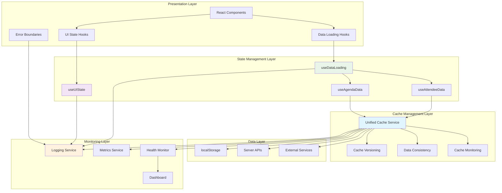

# Cache & State Integration Architecture

**Version:** 1.0  
**Last Updated:** 2025-01-20  
**Status:** ACTIVE - Implementation Ready  
**Related Stories:** 2.1c-2.1f4 (All Cache and State Stories)

## Overview

This document defines the comprehensive integration architecture that unifies cache management, state management, and monitoring systems for the Knowledge Now React PWA application. The architecture ensures seamless integration between all components while maintaining performance, reliability, and maintainability.

## Integration Principles

### 1. Unified Data Flow
- **Single Source of Truth:** All data flows through unified services
- **Consistent Patterns:** Standardized interfaces and behaviors
- **Clear Dependencies:** Explicit and manageable component relationships

### 2. Performance Optimization
- **Efficient Caching:** Optimal cache utilization and invalidation
- **Minimal Re-renders:** Optimized state updates and component rendering
- **Resource Management:** Efficient memory and network usage

### 3. Error Resilience
- **Graceful Degradation:** System continues functioning with reduced capabilities
- **Automatic Recovery:** Self-healing mechanisms for common issues
- **User Experience:** Seamless experience even during failures

### 4. Observability
- **End-to-End Tracing:** Complete request and data flow visibility
- **Performance Monitoring:** Real-time performance and health metrics
- **Proactive Alerting:** Early detection and notification of issues

## System Integration Architecture

### High-Level Integration



## Component Integration Patterns

### 1. Data Loading Integration

#### Hook Composition Pattern
```typescript
// Base data loading hook
const useDataLoading = <T>() => {
  const unifiedCache = useMemo(() => new UnifiedCacheService(), []);
  const metrics = useMemo(() => new MetricsService(), []);
  
  const loadData = useCallback(async (key: string, fetcher: () => Promise<T>, options: LoadOptions) => {
    const startTime = performance.now();
    
    try {
      // Try cache first
      const cached = await unifiedCache.get<T>(key);
      if (cached) {
        metrics.increment('cache.hits');
        metrics.record('cache.responseTime', performance.now() - startTime);
        return cached;
      }
      
      // Fetch from source
      const data = await fetcher();
      await unifiedCache.set(key, data, options.ttl);
      
      metrics.increment('cache.misses');
      metrics.record('api.responseTime', performance.now() - startTime);
      return data;
    } catch (error) {
      metrics.increment('errors.total');
      metrics.record('error.type', error.name);
      throw error;
    }
  }, [unifiedCache, metrics]);
  
  return { loadData, /* other methods */ };
};

// Specialized data loading hooks
const useAgendaData = () => {
  const { loadData, loading, error } = useDataLoading<PaginatedResponse<AgendaItem>>();
  
  const loadAgendaItems = useCallback(async () => {
    return loadData(
      'kn_cache_agenda_items',
      () => agendaService.getActiveAgendaItems(),
      { ttl: 5 * 60 * 1000 }
    );
  }, [loadData]);
  
  return { loadAgendaItems, loading, error };
};
```

### 2. State Management Integration

#### UI State with Cache Integration
```typescript
const useSessionData = () => {
  const { loadAgendaItems, agendaData, loading: agendaLoading } = useAgendaData();
  const { loadAttendee, attendeeData, loading: attendeeLoading } = useAttendeeData();
  
  const sessionState = useUIState({
    sessions: [],
    allSessions: [],
    currentSession: null,
    nextSession: null
  }, {
    validate: (state) => {
      // Validate state consistency
      if (state.sessions.length === 0 && state.allSessions.length > 0) {
        return 'Sessions filtered but no results';
      }
      return true;
    },
    persist: true,
    storageKey: 'kn_session_state'
  });
  
  const loadSessionData = useCallback(async () => {
    try {
      // Load agenda items
      const agendaResult = await loadAgendaItems();
      if (agendaResult?.success) {
        const allSessionsData = agendaResult.data || [];
        sessionState.updateState({ allSessions: allSessionsData });
        
        // Filter sessions for current attendee
        const filteredSessions = filterSessionsForAttendee(allSessionsData, attendeeData);
        sessionState.updateState({ sessions: filteredSessions });
      }
      
      // Load attendee data
      await loadAttendee();
      
    } catch (error) {
      sessionState.setError(error.message);
    }
  }, [loadAgendaItems, loadAttendee, sessionState, attendeeData]);
  
  return {
    ...sessionState.state,
    loading: agendaLoading || attendeeLoading,
    error: sessionState.error,
    loadSessionData
  };
};
```

### 3. Cache Service Integration

#### Unified Cache with Monitoring
```typescript
class UnifiedCacheService {
  private cacheVersioning: CacheVersioningService;
  private dataConsistency: DataConsistencyService;
  private monitoring: CacheMonitoringService;
  private metrics: MetricsService;
  
  constructor() {
    this.cacheVersioning = new CacheVersioningService();
    this.dataConsistency = new DataConsistencyService();
    this.monitoring = new CacheMonitoringService();
    this.metrics = new MetricsService();
  }
  
  async get<T>(key: string): Promise<T | null> {
    const startTime = performance.now();
    
    try {
      const entry = this.getCacheEntry(key);
      if (!entry) {
        this.monitoring.logCacheMiss(key, 'not_found');
        this.metrics.increment('cache.misses');
        return null;
      }
      
      const validation = this.cacheVersioning.validateCacheEntry(entry);
      if (!validation.isValid) {
        this.monitoring.logCacheCorruption(key, `Invalid: ${validation}`);
        this.metrics.increment('cache.corruptions');
        await this.remove(key);
        return null;
      }
      
      const responseTime = performance.now() - startTime;
      this.monitoring.logCacheHit(key, JSON.stringify(entry.data).length);
      this.metrics.increment('cache.hits');
      this.metrics.record('cache.responseTime', responseTime);
      
      return entry.data;
    } catch (error) {
      this.monitoring.logCacheCorruption(key, error.message);
      this.metrics.increment('cache.errors');
      return null;
    }
  }
  
  async set<T>(key: string, data: T, ttl?: number): Promise<void> {
    try {
      const entry = this.cacheVersioning.createCacheEntry(data, ttl);
      localStorage.setItem(key, JSON.stringify(entry));
      
      this.monitoring.logCacheHit(key, JSON.stringify(data).length);
      this.metrics.increment('cache.sets');
    } catch (error) {
      this.monitoring.logCacheCorruption(key, error.message);
      this.metrics.increment('cache.errors');
      throw error;
    }
  }
}
```

## Error Handling Integration

### 1. Error Boundary Integration
```typescript
class CacheErrorBoundary extends React.Component {
  constructor(props) {
    super(props);
    this.state = { hasError: false, error: null };
  }
  
  static getDerivedStateFromError(error) {
    return { hasError: true, error };
  }
  
  componentDidCatch(error, errorInfo) {
    // Log to monitoring service
    this.monitoringService.logError({
      level: 'error',
      category: 'cache',
      message: 'Cache error boundary triggered',
      data: {
        error: error.message,
        stack: error.stack,
        componentStack: errorInfo.componentStack
      },
      timestamp: new Date().toISOString()
    });
    
    // Record metrics
    this.metricsService.increment('errors.boundary');
  }
  
  render() {
    if (this.state.hasError) {
      return <CacheErrorFallback error={this.state.error} />;
    }
    return this.props.children;
  }
}
```

### 2. Graceful Degradation
```typescript
const useResilientData = (key, fetcher) => {
  const { data, loading, error, retry } = useDataLoading();
  const [fallbackData, setFallbackData] = useState(null);
  
  const loadWithFallback = useCallback(async () => {
    try {
      const result = await loadData(key, fetcher);
      setFallbackData(null); // Clear fallback on success
      return result;
    } catch (err) {
      // Try to use fallback data
      if (fallbackData) {
        setData(fallbackData);
        return fallbackData;
      }
      
      // Try to load from cache as last resort
      const cached = await unifiedCache.get(key);
      if (cached) {
        setData(cached);
        setFallbackData(cached);
        return cached;
      }
      
      throw err;
    }
  }, [key, fetcher, fallbackData]);
  
  return { data, loading, error, retry: loadWithFallback };
};
```

## Performance Integration

### 1. Memoization Strategy
```typescript
const useOptimizedSessionData = () => {
  const { loadAgendaItems, agendaData } = useAgendaData();
  const { loadAttendee, attendeeData } = useAttendeeData();
  
  // Memoize expensive computations
  const filteredSessions = useMemo(() => {
    if (!agendaData?.data || !attendeeData) return [];
    return filterSessionsForAttendee(agendaData.data, attendeeData);
  }, [agendaData?.data, attendeeData]);
  
  const currentSession = useMemo(() => {
    return findCurrentSession(filteredSessions);
  }, [filteredSessions]);
  
  const nextSession = useMemo(() => {
    return findNextSession(filteredSessions);
  }, [filteredSessions]);
  
  return {
    sessions: filteredSessions,
    currentSession,
    nextSession,
    loading: agendaData?.loading || attendeeData?.loading,
    error: agendaData?.error || attendeeData?.error
  };
};
```

### 2. Performance Monitoring
```typescript
const usePerformanceMonitoring = () => {
  const metrics = useMetrics();
  
  useEffect(() => {
    // Monitor render performance
    const observer = new PerformanceObserver((list) => {
      for (const entry of list.getEntries()) {
        if (entry.entryType === 'measure') {
          metrics.record('render.performance', entry.duration);
        }
      }
    });
    
    observer.observe({ entryTypes: ['measure'] });
    
    return () => observer.disconnect();
  }, [metrics]);
  
  return metrics;
};
```

## Testing Integration

### 1. Integration Test Patterns
```typescript
describe('Cache and State Integration', () => {
  let mockUnifiedCache: jest.Mocked<UnifiedCacheService>;
  let mockMetrics: jest.Mocked<MetricsService>;
  
  beforeEach(() => {
    mockUnifiedCache = createMockUnifiedCache();
    mockMetrics = createMockMetrics();
    
    // Mock service dependencies
    jest.doMock('../../services/unifiedCacheService', () => ({
      UnifiedCacheService: jest.fn(() => mockUnifiedCache)
    }));
  });
  
  it('should integrate data loading with cache and metrics', async () => {
    const { result } = renderHook(() => useAgendaData());
    
    // Test cache integration
    mockUnifiedCache.get.mockResolvedValue(mockAgendaData);
    
    await act(async () => {
      await result.current.loadAgendaItems();
    });
    
    expect(mockUnifiedCache.get).toHaveBeenCalledWith('kn_cache_agenda_items');
    expect(mockMetrics.increment).toHaveBeenCalledWith('cache.hits');
    expect(result.current.agendaData).toEqual(mockAgendaData);
  });
  
  it('should handle cache failures gracefully', async () => {
    const { result } = renderHook(() => useAgendaData());
    
    // Test error handling
    mockUnifiedCache.get.mockRejectedValue(new Error('Cache error'));
    
    await act(async () => {
      await result.current.loadAgendaItems();
    });
    
    expect(result.current.error).toBe('Cache error');
    expect(mockMetrics.increment).toHaveBeenCalledWith('cache.errors');
  });
});
```

### 2. End-to-End Integration Tests
```typescript
describe('End-to-End Cache and State Flow', () => {
  it('should complete full data flow from cache to UI', async () => {
    // Mock localStorage with cached data
    const cachedData = { data: mockAgendaItems, timestamp: new Date().toISOString() };
    localStorage.setItem('kn_cache_agenda_items', JSON.stringify(cachedData));
    
    render(
      <CacheErrorBoundary>
        <SessionProvider>
          <HomePage />
        </SessionProvider>
      </CacheErrorBoundary>
    );
    
    // Wait for data to load
    await waitFor(() => {
      expect(screen.getByText('Morning Session')).toBeInTheDocument();
    });
    
    // Verify cache was used
    expect(mockUnifiedCache.get).toHaveBeenCalledWith('kn_cache_agenda_items');
    
    // Verify metrics were recorded
    expect(mockMetrics.increment).toHaveBeenCalledWith('cache.hits');
  });
});
```

## Monitoring Integration

### 1. Comprehensive Monitoring
```typescript
const useIntegratedMonitoring = () => {
  const cacheHealth = useCacheHealth();
  const stateHealth = useStateHealth();
  const performanceMetrics = usePerformanceMetrics();
  
  const overallHealth = useMemo(() => {
    return {
      isHealthy: cacheHealth.isHealthy && stateHealth.isHealthy,
      status: cacheHealth.isHealthy && stateHealth.isHealthy ? 'healthy' : 'degraded',
      details: {
        cache: cacheHealth,
        state: stateHealth,
        performance: performanceMetrics
      }
    };
  }, [cacheHealth, stateHealth, performanceMetrics]);
  
  return overallHealth;
};
```

### 2. Real-time Dashboard Integration
```typescript
const IntegratedDashboard: React.FC = () => {
  const health = useIntegratedMonitoring();
  const metrics = useMetrics();
  
  return (
    <div className="integrated-dashboard">
      <HealthOverview health={health} />
      <CacheMetrics metrics={metrics.cache} />
      <StateMetrics metrics={metrics.state} />
      <PerformanceCharts metrics={metrics.performance} />
    </div>
  );
};
```

## Migration Strategy

### 1. Phased Integration
- **Phase 1:** Implement unified cache service
- **Phase 2:** Integrate data loading hooks
- **Phase 3:** Add UI state management hooks
- **Phase 4:** Implement comprehensive monitoring

### 2. Backward Compatibility
- Maintain existing APIs during migration
- Feature flags for new functionality
- Gradual rollout of new components
- Rollback capabilities

### 3. Testing Strategy
- Unit tests for individual components
- Integration tests for component interactions
- End-to-end tests for complete workflows
- Performance tests for optimization

## Success Metrics

### 1. Integration Quality
- **API Consistency:** 100% consistent interfaces
- **Error Handling:** < 1% unhandled errors
- **Performance:** < 50ms cache response time
- **Reliability:** > 99.9% uptime

### 2. Developer Experience
- **Code Reusability:** 70% reduction in duplicate code
- **Development Velocity:** 40% faster feature development
- **Debugging Time:** 50% reduction in issue resolution
- **Test Coverage:** > 90% coverage

### 3. System Performance
- **Cache Hit Rate:** > 90%
- **State Update Performance:** < 100ms
- **Memory Usage:** < 100MB
- **Network Requests:** 80% reduction

## Conclusion

This integration architecture provides a comprehensive, unified approach to cache management, state management, and monitoring in the Knowledge Now application. The clear integration patterns, robust error handling, and comprehensive monitoring ensure a reliable, performant, and maintainable system.

The architecture enables rapid development while maintaining high quality and reliability standards, providing an excellent foundation for future enhancements and scalability.
