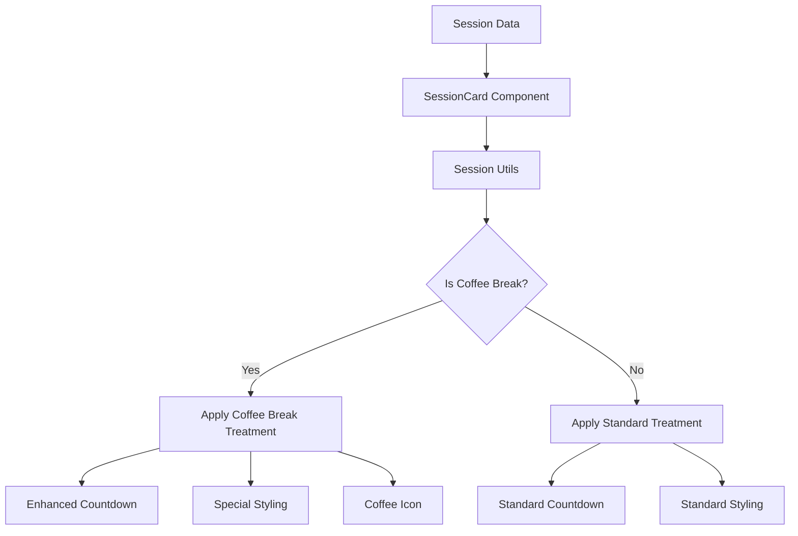

# Coffee Break Treatment Architecture

**Version:** 1.0  
**Last Updated:** 2025-01-16  
**Status:** ACTIVE - Special Session Treatment

## Overview

This document defines the **coffee break treatment architecture** for the Knowledge Now React application. Coffee breaks are a special case of meal-type sessions that require enhanced countdown treatment and visual styling to help attendees manage their break time effectively.

## ⚠️ CRITICAL: Coffee Break Special Treatment

### **Coffee Break Definition**

Coffee breaks are identified as:
- **Session Type**: `meal` (same as other meal sessions)
- **Title Pattern**: Contains "Coffee Break" (case insensitive)
- **Special Treatment**: Enhanced countdown and visual styling

### **Detection Logic**

```typescript
const isCoffeeBreak = (session) => {
  // Must be a meal type session
  const isMealType = session.session_type === 'meal' || 
                     (session.type && session.type.toLowerCase() === 'meal');

  // Title must contain "Coffee Break" (case insensitive)
  const hasCoffeeBreakInTitle = session.title.toLowerCase().includes('coffee break');

  return isMealType && hasCoffeeBreakInTitle;
};
```

### **Supported Title Formats**

- "Coffee Break"
- "Networking Coffee Break"
- "Morning Coffee Break"
- "Afternoon Coffee Break"
- "COFFEE BREAK" (uppercase)
- "coffee break" (lowercase)

## Coffee Break Treatment Features

### **1. Enhanced Countdown Treatment**

**When Active (Now Status):**
- Countdown timer replaces "NOW" text in status badge
- Real-time updates every minute
- Time range hidden when countdown is active
- Time range shown when countdown is not active

**When Inactive (Next Status):**
- Standard "Next" status text
- Time range always visible
- No countdown timer

### **2. Visual Styling Enhancements**

**Special Styling for Coffee Breaks in "Now" Status:**
```css
.session-card--coffee-break.session-card--now {
  background: var(--purple-050);
  border: 2px solid var(--purple-500);
  box-shadow: 0 4px 12px rgba(124, 76, 196, 0.15);
}
```

**Visual Indicators:**
- Coffee icon (☕) displayed next to title
- Enhanced card styling with purple theme
- Consistent with mockup design specifications

### **3. Countdown Priority System**

```typescript
const getCountdownPriority = (session) => {
  if (isCoffeeBreak(session)) {
    return 3; // Highest priority
  }
  
  if (isMeal(session)) {
    return 2; // Medium priority
  }
  
  return 1; // Lowest priority
};
```

## Implementation Architecture

### **Core Components**

#### 1. **Session Utils** (`src/utils/sessionUtils.js`)
- `isCoffeeBreak()` - Coffee break detection
- `isMeal()` - General meal detection
- `getSessionCategory()` - Session categorization
- `shouldShowCountdown()` - Countdown eligibility
- `getCountdownPriority()` - Priority system
- `getSessionIcon()` - Icon selection
- `getSessionClassName()` - CSS class generation

#### 2. **SessionCard Component** (`src/components/session/SessionCard.jsx`)
- Enhanced coffee break detection
- Special countdown treatment
- Visual styling application
- Icon display integration

#### 3. **Countdown Hook** (`src/hooks/useCountdown.js`)
- Real-time countdown updates
- App focus/blur handling
- Time override support

### **Data Flow**



### **State Management**

**Coffee Break State:**
- Detection: Based on session type and title
- Styling: Applied via CSS classes and inline styles
- Countdown: Managed by useCountdown hook
- Icons: Determined by session category

## Integration Points

### **HomePage Integration**
- Coffee breaks appear in Now/Next cards
- Special treatment applied automatically
- Consistent with mockup design

### **SchedulePage Integration**
- Coffee breaks maintain special treatment
- Countdown works in schedule view
- Visual consistency across components

### **AnimatedNowNextCards Integration**
- Coffee break animations work smoothly
- Special styling preserved during transitions
- Countdown updates during animations

## Testing Strategy

### **Unit Tests**
- Session utility functions
- Coffee break detection logic
- Countdown priority system
- Icon and styling functions

### **Component Tests**
- SessionCard coffee break rendering
- Countdown display logic
- Visual styling application
- Accessibility features

### **Integration Tests**
- Cross-component consistency
- Animation behavior
- Real-time updates
- Edge case handling

## Performance Considerations

### **Detection Performance**
- Coffee break detection is O(1) operation
- Cached results in component state
- Minimal impact on rendering performance

### **Countdown Performance**
- Real-time updates every minute
- Efficient timer management
- Proper cleanup on unmount

### **Styling Performance**
- CSS classes for static styling
- Inline styles only for dynamic properties
- Minimal re-renders

## Accessibility Features

### **ARIA Labels**
- Coffee break icon has proper aria-label
- Countdown timer is screen reader accessible
- Status changes are announced

### **Visual Indicators**
- High contrast for countdown text
- Clear visual distinction for coffee breaks
- Consistent with design system

## Edge Cases

### **Missing Data**
- Graceful handling of missing titles
- Fallback for missing time data
- Default behavior for invalid sessions

### **Title Variations**
- Case insensitive matching
- Support for various formats
- Robust detection logic

### **State Transitions**
- Smooth transitions between states
- Proper cleanup of timers
- Consistent behavior across components

## Future Enhancements

### **Potential Features**
- Custom countdown intervals
- Sound notifications
- Break time reminders
- Analytics tracking

### **Extensibility**
- Easy to add new special session types
- Configurable treatment rules
- Plugin architecture for custom treatments

## Migration Notes

### **Backward Compatibility**
- Existing sessions continue to work
- No breaking changes to API
- Gradual rollout possible

### **Configuration**
- Coffee break detection is automatic
- No configuration required
- Works with existing data structure

## Monitoring and Analytics

### **Key Metrics**
- Coffee break detection accuracy
- Countdown update frequency
- User interaction with coffee breaks
- Performance impact

### **Error Handling**
- Graceful degradation for detection failures
- Fallback to standard treatment
- Error logging and monitoring

## Security Considerations

### **Input Validation**
- Safe title matching
- No XSS vulnerabilities
- Proper data sanitization

### **Performance Security**
- No infinite loops in detection
- Proper resource cleanup
- Memory leak prevention

---

## Related Documentation

- [Session Filtering Architecture](./session-filtering-architecture.md)
- [Now/Next Glance Card Story](../stories/2.1.now-next-glance-card.md)
- [Coffee Break Treatment Story](../stories/2.2.coffee-break-treatment.md)
- [Component Testing Standards](../testing/Testing-Standards.md)
