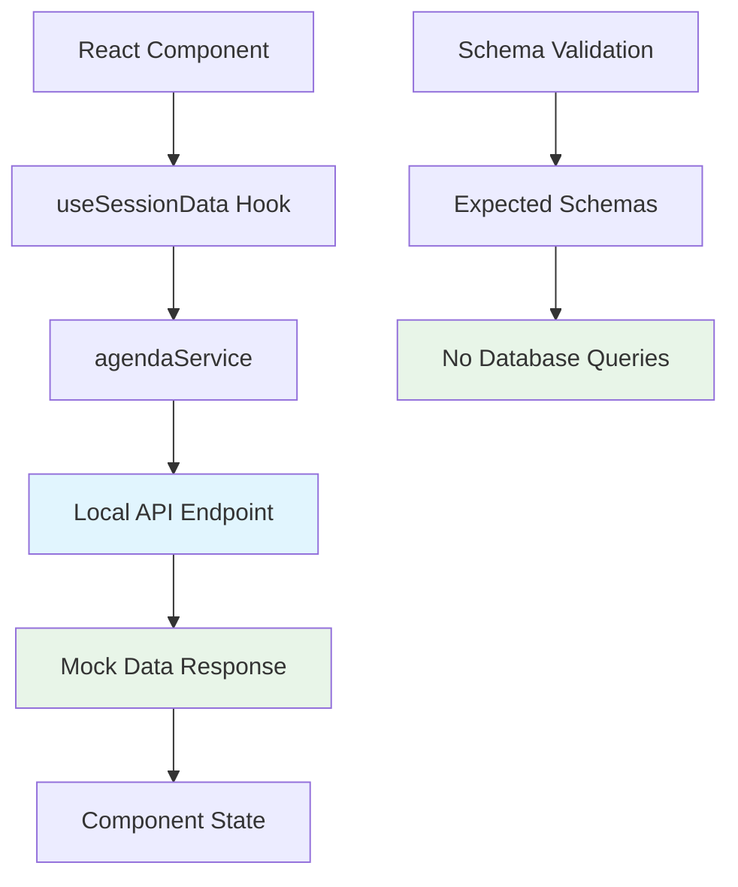
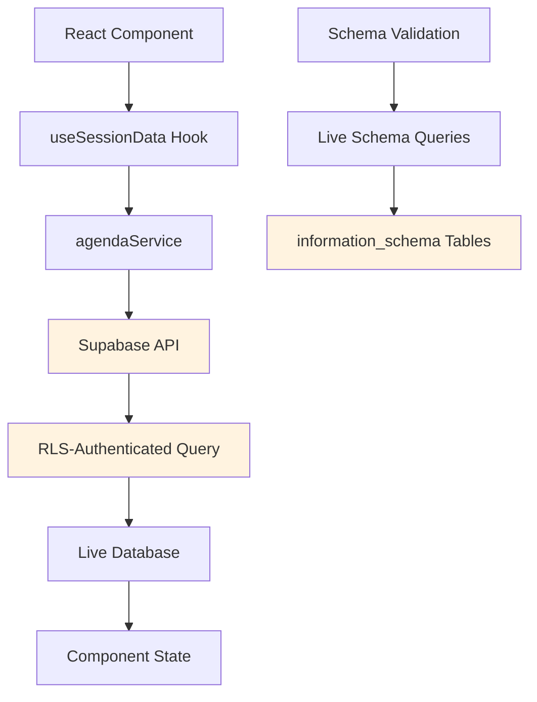

# Data Access Architecture

**Version:** 2.0  
**Last Updated:** 2025-01-16  
**Status:** CRITICAL - Prevents Infrastructure Issues  

## Overview

This document defines the **mandatory data access patterns** for the Knowledge Now React application to prevent infrastructure issues and ensure proper separation between local development and production environments.

## ⚠️ CRITICAL: Environment-Based Data Access

### **Local Development Mode**
- **Data Source**: Local API endpoints (`/api/*`)
- **Database**: No direct database connections
- **Authentication**: Mock authentication for development
- **Schema Validation**: Uses expected schemas, no live database queries

### **Production Mode**
- **Data Source**: Authenticated Supabase API
- **Database**: Direct Supabase connections with RLS
- **Authentication**: Full authentication flow
- **Schema Validation**: Live database schema validation

## Data Access Layers

### **1. Service Layer Architecture**

```typescript
// ✅ CORRECT: Environment-aware service layer
class DataService {
  private isLocalMode(): boolean {
    return process.env.NODE_ENV === 'development' || 
           process.env.NODE_ENV === 'test' ||
           window.location.hostname === 'localhost' ||
           window.location.hostname === '127.0.0.1';
  }

  async getData(): Promise<Data> {
    if (this.isLocalMode()) {
      return this.getLocalData();
    }
    return this.getProductionData();
  }
}
```

### **2. Local Development Data Flow**



### **3. Production Data Flow**



## Mandatory Implementation Patterns

### **1. Environment Detection**

**✅ REQUIRED**: All services must implement environment detection:

```typescript
// src/services/baseService.ts
export abstract class BaseService {
  protected isLocalMode(): boolean {
    return process.env.NODE_ENV === 'development' || 
           process.env.NODE_ENV === 'test' ||
           window.location.hostname === 'localhost' ||
           window.location.hostname === '127.0.0.1';
  }

  protected getApiBaseUrl(): string {
    return this.isLocalMode() ? '/api' : 'https://iikcgdhztkrexuuqheli.supabase.co';
  }
}
```

### **2. Schema Validation Service**

**✅ REQUIRED**: Schema validation must skip Supabase queries in local mode:

```typescript
// src/services/schemaValidationService.ts
export class SchemaValidationService {
  private isLocalMode(): boolean {
    return process.env.NODE_ENV === 'development' || 
           process.env.NODE_ENV === 'test' ||
           window.location.hostname === 'localhost' ||
           window.location.hostname === '127.0.0.1';
  }

  private async getAllTables(): Promise<TableSchema[]> {
    // Skip Supabase queries in local mode
    if (this.isLocalMode()) {
      console.log('🏠 Local mode detected - skipping Supabase schema validation');
      return this.getExpectedTables();
    }
    
    // Production: Use live Supabase queries
    return this.queryLiveSchema();
  }
}
```

### **3. Data Service Implementation**

**✅ REQUIRED**: Data services must use local APIs in development:

```typescript
// src/services/dataService.ts
export class DataService extends BaseService {
  async getCurrentAttendeeData(): Promise<Attendee | null> {
    if (this.isLocalMode()) {
      // Local development: Use mock data or local API
      return this.getLocalAttendeeData();
    }
    
    // Production: Use Supabase API
    return this.getSupabaseAttendeeData();
  }
}
```

## Service-Specific Requirements

### **Agenda Service**

```typescript
// src/services/agendaService.ts
export class AgendaService extends BaseService {
  private getBasePath(): string {
    return this.isLocalMode() ? '/api/agenda-items' : '/rest/v1/agenda_items';
  }

  async getActiveAgendaItems(): Promise<PaginatedResponse<AgendaItem>> {
    const path = this.getBasePath();
    // Implementation handles both local and production endpoints
  }
}
```

### **PWA Data Sync Service**

```typescript
// src/services/pwaDataSyncService.ts
export class PWADataSyncService {
  constructor() {
    // Only initialize schema validation in production
    if (!this.isLocalMode()) {
      this.schemaValidator = new SchemaValidationService();
    }
  }
}
```

## Error Handling Patterns

### **1. API Error Handling**

```typescript
// src/services/dataService.ts
const apiGet = async <T>(path: string): Promise<T> => {
  const response = await fetch(path, { credentials: 'include' });
  
  // Check content type before parsing to prevent HTML parsing errors
  const contentType = response.headers.get('content-type');
  if (!contentType?.includes('application/json')) {
    console.error(`❌ API returned non-JSON content: ${contentType} for path: ${path}`);
    throw new DataServiceError(`Expected JSON but got ${contentType || 'unknown content type'}`, 'INVALID_CONTENT_TYPE');
  }
  
  // Rest of implementation...
};
```

### **2. Fallback Mechanisms**

```typescript
// src/services/dataService.ts
export const getCurrentAttendeeData = async (): Promise<Attendee | null> => {
  try {
    // Primary data source
    return await this.getPrimaryData();
  } catch (error) {
    console.error('❌ Error fetching current attendee:', error);
    
    // Try to fallback to cached data if API fails
    try {
      const cachedData = localStorage.getItem('kn_cache_attendees');
      if (cachedData) {
        const attendees = JSON.parse(cachedData);
        const current = getCurrentAttendee();
        if (current?.id) {
          const cachedAttendee = attendees.find((a: Attendee) => a.id === current.id);
          if (cachedAttendee) {
            console.log('✅ Using cached attendee data as fallback');
            return cachedAttendee;
          }
        }
      }
    } catch (cacheError) {
      console.warn('⚠️ Failed to load cached attendee data:', cacheError);
    }
    
    throw new DataServiceError('Failed to fetch current attendee data', 'FETCH_ERROR');
  }
};
```

## Testing Requirements

### **1. Environment Mocking**

```typescript
// src/__tests__/setup/testSetup.ts
beforeEach(() => {
  // Mock environment detection
  vi.stubEnv('NODE_ENV', 'test');
  
  // Mock localStorage
  Object.defineProperty(window, 'localStorage', {
    value: mockLocalStorage,
    writable: true
  });
});
```

### **2. Service Testing**

```typescript
// src/__tests__/services/dataService.test.ts
describe('DataService Environment Detection', () => {
  it('should use local mode in development', () => {
    vi.stubEnv('NODE_ENV', 'development');
    const service = new DataService();
    expect(service.isLocalMode()).toBe(true);
  });

  it('should use production mode in production', () => {
    vi.stubEnv('NODE_ENV', 'production');
    const service = new DataService();
    expect(service.isLocalMode()).toBe(false);
  });
});
```

## Deployment Considerations

### **1. Environment Variables**

```bash
# .env.development
NODE_ENV=development
VITE_API_BASE_URL=/api
VITE_USE_LOCAL_DATA=true

# .env.production
NODE_ENV=production
VITE_API_BASE_URL=https://iikcgdhztkrexuuqheli.supabase.co
VITE_USE_LOCAL_DATA=false
```

### **2. Build Configuration**

```typescript
// vite.config.ts
export default defineConfig({
  define: {
    __LOCAL_MODE__: process.env.NODE_ENV === 'development'
  }
});
```

## Monitoring and Debugging

### **1. Console Logging**

```typescript
// All services should log environment mode
console.log('🏠 Local mode detected - using local data sources');
console.log('🌐 Production mode detected - using Supabase API');
```

### **2. Error Tracking**

```typescript
// Track environment-specific errors
if (this.isLocalMode()) {
  console.error('❌ Local API error:', error);
} else {
  console.error('❌ Supabase API error:', error);
}
```

## Migration Checklist

### **✅ Completed**
- [x] Schema validation service updated with local mode detection
- [x] Data service enhanced with content-type validation
- [x] Cache fallback mechanisms implemented
- [x] Error handling improved for HTML responses

### **🔄 In Progress**
- [ ] Update all service classes to extend BaseService
- [ ] Implement environment detection in all data access points
- [ ] Add comprehensive testing for environment modes
- [ ] Update documentation for all affected services

### **📅 Planned**
- [ ] Create environment-specific configuration files
- [ ] Implement automated environment detection testing
- [ ] Add monitoring for environment-specific errors
- [ ] Create deployment scripts for environment management

## Related Documents

- **Database Schema**: `docs/architecture/database-schema.md`
- **PWA Architecture**: `docs/architecture/pwa-architecture.md`
- **Supabase RLS Troubleshooting**: `docs/architecture/supabase-rls-troubleshooting.md`
- **Frontend Architecture**: `docs/architecture/frontend-refactoring-plan.md`

## Success Metrics

- **✅ No Supabase 404 Errors**: Schema validation skips live queries in local mode
- **✅ Local Development Works**: All features function without external dependencies
- **✅ Production Integration**: Full Supabase functionality in production
- **✅ Cache Fallback**: Graceful degradation when APIs fail
- **✅ Environment Detection**: Automatic mode switching based on environment

---

**This architecture ensures that Story 2.1 and future stories work correctly in both local development and production environments without infrastructure conflicts.**
