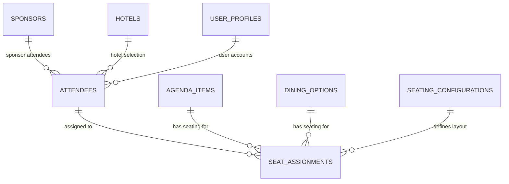

# Database Schema Reference

**Version:** 1.0  
**Last Updated:** 2025-09-09  
**Connection Method:** Authenticated Supabase API (per ADR-003)  
**Database URL:** https://iikcgdhztkrexuuqheli.supabase.co

## Overview

This document provides the authoritative reference for the Knowledge Now React application database schema. All other database-related documents should reference this as the single source of truth.

### Database Summary
- **Total Tables:** 11 (accessible tables)
- **Total Rows:** 325 (with authenticated access)
- **Connection Method:** Authenticated Supabase API (RLS-compliant)
- **Authentication:** Server-side authentication with admin credentials
- **⚠️ CRITICAL**: Anonymous access blocked by RLS policies - returns 0 rows

## Core Application Tables

### 1. attendees (235 rows, 35 columns)
**Primary entity for event attendees**

```typescript
interface Attendee {
  id: string
  // Personal Information
  salutation: string
  first_name: string
  last_name: string
  email: string
  title: string
  company: string
  bio: string
  photo: string
  
  // Contact Information
  business_phone: string
  mobile_phone: string
  address1: string
  address2: string
  postal_code: string
  city: string
  state: string
  country: string
  country_code: string
  
  // Event Preferences
  hotel_selection: string
  dining_selections: any[] // JSON array
  selected_breakouts: any[] // JSON array
  attributes: any // JSON object
  
  // Role Attributes
  is_cfo: boolean
  is_apax_ep: boolean
  sponsorAttendee: boolean
  
  // Assistant Information
  assistant_name: string
  assistant_email: string
  
  // System Fields
  idloom_id: string
  last_synced_at: string
  created_at: string
  updated_at: string
}
```

### 2. agenda_items (8 rows, 18 columns)
**Event sessions and agenda items**

```typescript
interface AgendaItem {
  id: string
  title: string
  description: string
  date: string // YYYY-MM-DD format
  start_time: string // HH:MM:SS format
  end_time: string // HH:MM:SS format
  location: string
  type: string // executive-presentation, breakout-session, etc.
  speaker: string | null
  capacity: number
  registered_count: number
  attendee_selection: string // "everyone", "selected", etc.
  selected_attendees: any[] // Array of attendee IDs
  is_active: boolean
  has_seating: boolean
  seating_notes: string
  seating_type: string // "open", "assigned"
  created_at: string
  updated_at: string
}
```

### 3. sponsors (27 rows, 7 columns)
**Event sponsors and partners**

```typescript
interface Sponsor {
  id: string
  name: string
  logo: string
  website: string
  is_active: boolean
  display_order: number
  created_at: string
}
```

### 4. seat_assignments (48 rows, 15 columns)
**Seat assignments for events**

```typescript
interface SeatAssignment {
  id: string
  seating_configuration_id: string
  attendee_id: string
  table_name: string
  seat_number: number
  seat_position: any // JSON object with x, y coordinates
  assignment_type: string
  assigned_at: string
  notes: string
  column_number: number
  row_number: number
  attendee_first_name: string
  attendee_last_name: string
  created_at: string
  updated_at: string
}
```

### 5. dining_options (2 rows, 17 columns)
**Dining venues and options**

```typescript
interface DiningOption {
  id: string
  name: string
  date: string
  time: string
  location: string
  address: string
  address_validated: boolean
  capacity: number
  has_table_assignments: boolean
  tables: any[] // JSON array of table configurations
  layout_template_id: string
  seating_notes: string
  seating_type: string
  is_active: boolean
  display_order: number
  created_at: string
  updated_at: string
}
```

### 6. hotels (3 rows, 8 columns)
**Hotel accommodations**

```typescript
interface Hotel {
  id: string
  name: string
  address: string
  phone: string
  website: string
  is_active: boolean
  display_order: number
  created_at: string
}
```

### 7. seating_configurations (2 rows, 13 columns)
**Seating layout configurations**

```typescript
interface SeatingConfiguration {
  id: string
  agenda_item_id: string
  dining_option_id: string
  layout_template_id: string
  has_seating: boolean
  seating_type: string
  auto_assignment_rules: any // JSON object
  is_active: boolean
  layout_type: string
  layout_config: any // JSON object
  configuration_status: string
  created_at: string
  updated_at: string
}
```

### 8. user_profiles (1 row, 8 columns)
**User account profiles**

```typescript
interface UserProfile {
  id: string
  user_id: string
  role: string
  email: string
  first_name: string
  last_name: string
  is_active: boolean
  created_at: string
}
```

## Admin-Only Tables

These tables are used for administrative purposes and are not needed by the main application:

- `layout_templates` (0 rows) - Seating layout templates
- `import_history` (0 rows) - Data import tracking
- `breakout_sessions` (0 rows) - Historical breakout session data

## Entity Relationships



## Implementation Status

### Ready for Implementation (8 tables - 73%)
- ✅ attendees - Complete with all fields verified
- ✅ agenda_items - Complete with all fields verified
- ✅ sponsors - Complete with all fields verified
- ✅ seat_assignments - Complete with all fields verified
- ✅ dining_options - Complete with all fields verified
- ✅ hotels - Complete with all fields verified
- ✅ seating_configurations - Complete with all fields verified
- ✅ user_profiles - Complete with all fields verified

### Need Investigation (3 tables - 27%)
- ⚠️ layout_templates - Admin tool, needs UI analysis
- ⚠️ import_history - Admin tool, needs investigation
- ⚠️ breakout_sessions - Historical data, needs clarification

## Connection Details

### Authentication
- **Method**: Server-side authentication with Supabase client
- **Credentials**: `ishan.gammampila@apax.com` / `xx8kRx#tn@R?`
- **RLS Bypass**: Authenticated requests bypass Row Level Security policies

### ⚠️ CRITICAL: RLS Authentication Required

**Problem**: This database uses Row Level Security (RLS) policies that block anonymous access to data.

**Symptoms**:
- Anonymous Supabase API returns 0 rows for all tables
- Table discovery works (can see table names)
- Data access fails (returns empty arrays)
- Admin interface works because it uses authenticated access

**Solution**: Always use authenticated access with admin credentials:

```javascript
// REQUIRED: Authenticate before accessing data
const { data, error } = await supabase.auth.signInWithPassword({
  email: 'ishan.gammampila@apax.com',
  password: 'xx8kRx#tn@R?'
});
```

**Key Points**:
- ✅ Anonymous access: Can discover tables but returns 0 rows
- ✅ Authenticated access: Bypasses RLS and returns actual data
- ✅ All services must use authenticated Supabase client
- ✅ This is a recurring issue - always check authentication first

### API Endpoints
- **Base URL**: `https://iikcgdhztkrexuuqheli.supabase.co`
- **Client**: `@supabase/supabase-js`
- **Authentication**: `supabase.auth.signInWithPassword()`

## Usage Notes

- All field names and types are verified against actual database schema
- JSON fields contain structured data (arrays, objects)
- Timestamps are in ISO 8601 format
- Boolean fields use `is_` prefix for clarity
- All tables have `created_at` and `updated_at` timestamps

## Related Documents

- **ADR-003**: Vercel spike solution and authentication approach
- **greenfield-architecture.md**: Overall system architecture
- **database-driven-architecture.md**: Architecture decisions based on schema
- **supabase-rls-troubleshooting.md**: ⚠️ CRITICAL - RLS authentication troubleshooting guide
