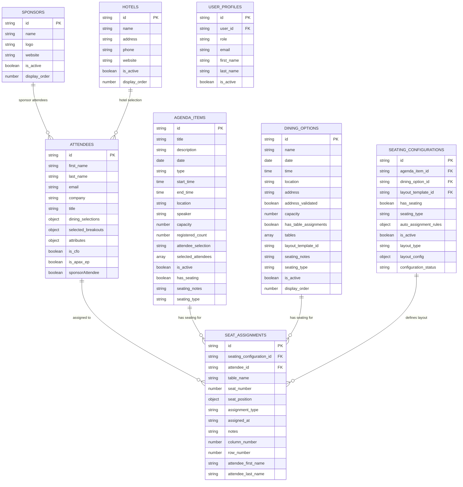

# Entity Relationships Analysis

**Generated:** 2025-09-08  
**Based on:** UI Analysis of Admin Interfaces  
**Purpose:** Document relationships between database entities

## Overview

This document analyzes the relationships between different entities in the Knowledge Now event management system based on UI form analysis and existing database structure.

## Entity Relationship Map



## Key Relationships

### 1. Attendees ↔ Seat Assignments
**Relationship**: One-to-Many  
**Business Logic**: Each attendee can have multiple seat assignments across different events

```typescript
interface AttendeeSeatRelationship {
  attendee: Attendee
  seatAssignments: SeatAssignment[]
  // Derived from existing data
  attendee_first_name: string  // Denormalized for performance
  attendee_last_name: string   // Denormalized for performance
}
```

### 2. Agenda Items ↔ Seat Assignments
**Relationship**: One-to-Many  
**Business Logic**: Agenda items with "assigned-seating" type can have seat assignments

```typescript
interface AgendaSeatingRelationship {
  agendaItem: AgendaItem
  seatAssignments: SeatAssignment[]
  // Only applicable when seating_type = 'assigned-seating'
  seatingCapacity: number
}
```

### 3. Dining Options ↔ Seat Assignments
**Relationship**: One-to-Many  
**Business Logic**: Dining options with "assigned-seating" type can have seat assignments

```typescript
interface DiningSeatingRelationship {
  diningOption: DiningOption
  seatAssignments: SeatAssignment[]
  // Only applicable when seating_type = 'assigned-seating'
  maximumCapacity: number
}
```

### 4. Seating Configurations ↔ Seat Assignments
**Relationship**: One-to-Many  
**Business Logic**: Seating configurations define the layout for seat assignments

```typescript
interface SeatingConfigRelationship {
  seatingConfiguration: SeatingConfiguration
  seatAssignments: SeatAssignment[]
  // Layout data defines available positions
  layoutData: LayoutData
}
```

### 5. Sponsors ↔ Attendees
**Relationship**: One-to-Many  
**Business Logic**: Sponsors can have multiple attendees (sponsor attendees)

```typescript
interface SponsorAttendeeRelationship {
  sponsor: Sponsor
  sponsorAttendees: Attendee[]
  // Identified by attributes.sponsorAttendee = true
  sponsorCompany: string
}
```

### 6. Hotels ↔ Attendees
**Relationship**: One-to-Many  
**Business Logic**: Hotels can have multiple attendees selecting them for accommodation

```typescript
interface HotelAttendeeRelationship {
  hotel: Hotel
  hotelAttendees: Attendee[]
  // Identified by hotel_selection field in attendee data
  selectionCount: number
  roomTypes: string[]
}
```

## Data Flow Patterns

### 1. Seating Management Flow

```typescript
// 1. Create seating configuration
const seatingConfig = await createSeatingConfiguration({
  name: "Grand Ballroom Layout",
  layoutData: { /* grid layout */ },
  totalSeats: 250
})

// 2. Create agenda item with assigned seating
const agendaItem = await createAgendaItem({
  session_title: "Opening Remarks",
  seating_type: "assigned-seating",
  seating_capacity: 250
})

// 3. Assign seats to attendees
const seatAssignment = await createSeatAssignment({
  attendee_id: "attendee-123",
  seating_configuration_id: seatingConfig.id,
  agenda_item_id: agendaItem.id,
  seat_position: { x: 5, y: 4 },
  row_number: 4,
  column_number: 5
})
```

### 2. Dining Selection Flow

```typescript
// 1. Attendee selects dining options
const attendee = await updateAttendee("attendee-123", {
  dining_selections: {
    "welcome-reception-monday": {
      attending: true,
      dining_option_id: "dining-option-456"
    }
  }
})

// 2. If dining option has assigned seating, create seat assignment
if (diningOption.seating_type === "assigned-seating") {
  await createSeatAssignment({
    attendee_id: "attendee-123",
    dining_option_id: "dining-option-456",
    seat_position: { x: 2, y: 3 }
  })
}
```

### 3. Sponsor Management Flow

```typescript
// 1. Create sponsor
const sponsor = await createSponsor({
  name: "Accordion",
  logo: "https://logo.clearbit.com/accordion.com",
  website: "https://accordion.com",
  display_order: 1
})

// 2. Mark attendees as sponsor attendees
const sponsorAttendees = await updateAttendees({
  company: "Accordion",
  attributes: {
    sponsorAttendee: true
  }
})
```

## Business Rules

### 1. Seating Rules
- **Assigned Seating**: Only agenda items and dining options with `seating_type = 'assigned-seating'` can have seat assignments
- **Open Seating**: No seat assignments needed, attendees can sit anywhere
- **Capacity Limits**: Seat assignments cannot exceed seating capacity
- **Unique Assignments**: Each attendee can only have one seat per event

### 2. Attendee Rules
- **Dining Selections**: Attendees can select multiple dining options
- **Breakout Sessions**: Attendees can select multiple breakout sessions
- **Role Attributes**: Attendees can have multiple role attributes (CEO, CFO, sponsor, etc.)
- **Spouse Management**: Spouse details are stored as JSON object

### 3. Event Rules
- **Display Order**: Both agenda items and dining options have display order for UI presentation
- **Active Status**: Dining options can be marked as inactive to hide from selection
- **Date/Time**: All events have consistent date/time format
- **Location**: Separate fields for venue name and address

## API Design Implications

### 1. Nested Queries
```typescript
// Get attendee with all related data
const attendeeWithRelations = await supabase
  .from('attendees')
  .select(`
    *,
    seat_assignments (
      *,
      agenda_items (session_title, date, start_time),
      dining_options (event_name, date, time)
    )
  `)
  .eq('id', attendeeId)
  .single()
```

### 2. Bulk Operations
```typescript
// Bulk seat assignment for an event
const bulkSeatAssignment = async (eventId: string, assignments: SeatAssignment[]) => {
  return await supabase
    .from('seat_assignments')
    .insert(assignments.map(assignment => ({
      ...assignment,
      agenda_item_id: eventId
    })))
}
```

### 3. Real-time Updates
```typescript
// Real-time seat assignment updates
const subscribeToSeatChanges = (eventId: string) => {
  return supabase
    .channel('seat-assignments')
    .on('postgres_changes', {
      event: '*',
      schema: 'public',
      table: 'seat_assignments',
      filter: `agenda_item_id=eq.${eventId}`
    }, (payload) => {
      // Update UI with real-time changes
      updateSeatAssignment(payload.new)
    })
    .subscribe()
}
```

## Performance Considerations

### 1. Denormalization
- **Attendee Names**: Stored in seat_assignments for performance
- **Display Order**: Used for efficient UI sorting
- **Active Status**: Used for filtering without joins

### 2. Indexing Strategy
```sql
-- Composite indexes for common queries
CREATE INDEX idx_seat_assignments_event_attendee 
ON seat_assignments(agenda_item_id, attendee_id);

CREATE INDEX idx_attendees_company_sponsor 
ON attendees(company, (attributes->>'sponsorAttendee'));

CREATE INDEX idx_dining_options_active_date 
ON dining_options(active, date);
```

### 3. Caching Strategy
```typescript
// Cache frequently accessed data
const cacheConfig = {
  attendees: { ttl: 5 * 60 * 1000 }, // 5 minutes
  sponsors: { ttl: 60 * 60 * 1000 }, // 1 hour
  seatingConfigurations: { ttl: 30 * 60 * 1000 }, // 30 minutes
  diningOptions: { ttl: 10 * 60 * 1000 } // 10 minutes
}
```

## Conclusion

The entity relationships reveal a sophisticated event management system with:

1. **Flexible Seating**: Support for both open and assigned seating across different event types
2. **Rich Attendee Data**: Comprehensive attendee profiles with preferences and role attributes
3. **Event Management**: Unified approach to agenda items and dining options
4. **Sponsor Integration**: Clear sponsor-attendee relationships
5. **Real-time Capabilities**: Support for live updates and collaborative management

This analysis provides the foundation for building a robust, type-safe, and performant event management application.

---

*This analysis is based on UI form analysis and existing database structure, providing a comprehensive understanding of entity relationships and business logic.*
