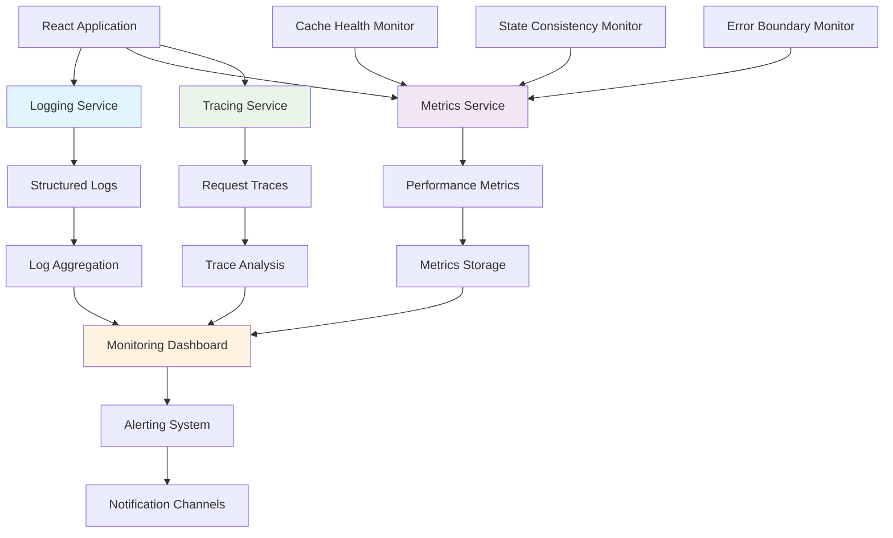

# Monitoring & Observability Architecture

**Version:** 1.0  
**Last Updated:** 2025-01-20  
**Status:** ACTIVE - Implementation Ready  
**Related Stories:** 2.1d, 2.1e1, 2.1e2

## Overview

This document defines the comprehensive monitoring and observability architecture for the Knowledge Now React PWA application. The architecture provides real-time monitoring, performance tracking, and proactive issue detection for cache management and state management systems.

## Problem Statement

The current application lacks comprehensive monitoring capabilities:
- **Limited visibility** into cache operations and performance
- **No proactive monitoring** of system health and data consistency
- **Insufficient logging** for debugging and issue resolution
- **No performance metrics** for optimization and capacity planning

## Architectural Principles

### 1. Observability First
- **Logging:** Comprehensive event logging with structured data
- **Metrics:** Quantitative performance and health indicators
- **Tracing:** Distributed request tracing across components
- **Alerting:** Proactive notification of issues and anomalies

### 2. Real-time Monitoring
- Live dashboards for system health
- Real-time performance metrics
- Immediate issue detection
- Automated alerting and escalation

### 3. Developer Experience
- Easy-to-use monitoring tools
- Clear error messages and debugging information
- Performance profiling capabilities
- Development mode helpers

### 4. Production Ready
- Scalable monitoring infrastructure
- Secure data collection and storage
- Compliance with privacy regulations
- Cost-effective monitoring solutions

## System Architecture

### Core Components



### 1. Logging Service

#### Structured Logging
**Purpose:** Consistent, searchable, and actionable log data

**Log Levels:**
- **ERROR:** System errors and failures
- **WARN:** Potential issues and degraded performance
- **INFO:** General application flow and state changes
- **DEBUG:** Detailed debugging information

**Log Format:**
```typescript
interface LogEntry {
  level: 'error' | 'warn' | 'info' | 'debug';
  category: 'cache' | 'state' | 'api' | 'ui' | 'auth';
  message: string;
  data: Record<string, any>;
  timestamp: string;
  sessionId?: string;
  userId?: string;
  requestId?: string;
  duration?: number;
  error?: {
    name: string;
    message: string;
    stack?: string;
  };
}
```

#### Cache Operation Logging
```typescript
// Cache hit logging
console.log('✅ CACHE HIT:', {
  level: 'info',
  category: 'cache',
  message: 'Cache hit for agenda items',
  data: {
    cacheKey: 'kn_cache_agenda_items',
    dataSize: 1024,
    responseTime: 15,
    hitRate: 0.85
  },
  timestamp: new Date().toISOString()
});

// Cache miss logging
console.log('❌ CACHE MISS:', {
  level: 'info',
  category: 'cache',
  message: 'Cache miss for agenda items',
  data: {
    cacheKey: 'kn_cache_agenda_items',
    reason: 'not_found',
    fallbackUsed: true
  },
  timestamp: new Date().toISOString()
});
```

### 2. Metrics Service

#### Performance Metrics
**Purpose:** Quantitative measurement of system performance

**Key Metrics:**
- **Cache Performance:** Hit rate, miss rate, response time
- **State Management:** Update frequency, validation success rate
- **API Performance:** Request duration, success rate, error rate
- **UI Performance:** Render time, interaction response time

**Metrics Collection:**
```typescript
interface CacheMetrics {
  hits: number;
  misses: number;
  hitRate: number;
  averageResponseTime: number;
  totalDataSize: number;
  corruptionCount: number;
  lastUpdated: string;
}

interface StateMetrics {
  stateUpdates: number;
  validationFailures: number;
  errorCount: number;
  averageUpdateTime: number;
  lastUpdated: string;
}
```

#### Real-time Metrics
```typescript
class MetricsService {
  private metrics: Map<string, number> = new Map();
  private listeners: Set<(metrics: Metrics) => void> = new Set();
  
  increment(metric: string, value: number = 1) {
    const current = this.metrics.get(metric) || 0;
    this.metrics.set(metric, current + value);
    this.notifyListeners();
  }
  
  set(metric: string, value: number) {
    this.metrics.set(metric, value);
    this.notifyListeners();
  }
  
  get(metric: string): number {
    return this.metrics.get(metric) || 0;
  }
  
  getAll(): Record<string, number> {
    return Object.fromEntries(this.metrics);
  }
  
  subscribe(listener: (metrics: Metrics) => void) {
    this.listeners.add(listener);
    return () => this.listeners.delete(listener);
  }
  
  private notifyListeners() {
    this.listeners.forEach(listener => listener(this.getAll()));
  }
}
```

### 3. Health Monitoring

#### Cache Health Monitor
**Purpose:** Proactive monitoring of cache system health

**Health Indicators:**
- **Data Consistency:** Cache vs UI state alignment
- **Performance:** Response times and throughput
- **Reliability:** Error rates and failure patterns
- **Capacity:** Memory usage and storage limits

**Health Status:**
```typescript
interface CacheHealthStatus {
  isHealthy: boolean;
  status: 'healthy' | 'degraded' | 'unhealthy' | 'unknown';
  metrics: CacheMetrics;
  consistency: ConsistencyReport;
  lastChecked: string;
  issues: HealthIssue[];
}

interface HealthIssue {
  type: 'performance' | 'consistency' | 'reliability' | 'capacity';
  severity: 'low' | 'medium' | 'high' | 'critical';
  message: string;
  timestamp: string;
  resolution?: string;
}
```

#### State Consistency Monitor
**Purpose:** Validation of state consistency across components

**Consistency Checks:**
- Cache data vs UI state alignment
- State validation success rates
- Error boundary triggers
- Memory leak detection

### 4. Monitoring Dashboard

#### Real-time Dashboard
**Purpose:** Visual representation of system health and performance

**Dashboard Components:**
- **Health Status:** Overall system health indicator
- **Performance Metrics:** Real-time performance charts
- **Error Tracking:** Error rates and patterns
- **Cache Analytics:** Cache performance and usage

**Dashboard Implementation:**
```typescript
const MonitoringDashboard: React.FC = () => {
  const [healthStatus, setHealthStatus] = useState<CacheHealthStatus | null>(null);
  const [metrics, setMetrics] = useState<Metrics>({});
  const [isVisible, setIsVisible] = useState(false);
  
  useEffect(() => {
    const interval = setInterval(async () => {
      const health = await cacheHealthService.getHealthStatus();
      const currentMetrics = metricsService.getAll();
      
      setHealthStatus(health);
      setMetrics(currentMetrics);
    }, 5000);
    
    return () => clearInterval(interval);
  }, []);
  
  if (!isVisible) {
    return (
      <button 
        className="monitoring-toggle"
        onClick={() => setIsVisible(true)}
      >
        📊 System Health
      </button>
    );
  }
  
  return (
    <div className="monitoring-dashboard">
      <div className="dashboard-header">
        <h3>System Health Dashboard</h3>
        <button onClick={() => setIsVisible(false)}>×</button>
      </div>
      
      <div className="health-overview">
        <HealthStatusIndicator status={healthStatus?.status} />
        <PerformanceChart metrics={metrics} />
        <ErrorTracking errors={healthStatus?.issues} />
      </div>
    </div>
  );
};
```

## Alerting System

### 1. Alert Rules
**Purpose:** Automated detection of issues and anomalies

**Alert Types:**
- **Performance Alerts:** Response time thresholds, error rate spikes
- **Consistency Alerts:** Data inconsistency detection
- **Capacity Alerts:** Memory usage, storage limits
- **Reliability Alerts:** Service failures, error patterns

**Alert Configuration:**
```typescript
interface AlertRule {
  id: string;
  name: string;
  condition: (metrics: Metrics) => boolean;
  severity: 'low' | 'medium' | 'high' | 'critical';
  message: string;
  cooldown: number; // seconds
  enabled: boolean;
}

const alertRules: AlertRule[] = [
  {
    id: 'cache-hit-rate-low',
    name: 'Cache Hit Rate Low',
    condition: (metrics) => metrics.cacheHitRate < 0.8,
    severity: 'medium',
    message: 'Cache hit rate is below 80%',
    cooldown: 300,
    enabled: true
  },
  {
    id: 'response-time-high',
    name: 'Response Time High',
    condition: (metrics) => metrics.averageResponseTime > 1000,
    severity: 'high',
    message: 'Average response time exceeds 1 second',
    cooldown: 60,
    enabled: true
  }
];
```

### 2. Notification Channels
**Purpose:** Delivery of alerts to appropriate stakeholders

**Notification Types:**
- **In-app Notifications:** Real-time alerts in the application
- **Console Logs:** Developer debugging information
- **External Services:** Slack, email, PagerDuty integration

## Performance Monitoring

### 1. Core Web Vitals
**Purpose:** Measurement of user experience metrics

**Metrics:**
- **Largest Contentful Paint (LCP):** Loading performance
- **First Input Delay (FID):** Interactivity
- **Cumulative Layout Shift (CLS):** Visual stability

### 2. Custom Performance Metrics
**Purpose:** Application-specific performance indicators

**Metrics:**
- **Cache Performance:** Hit rate, response time, data size
- **State Management:** Update frequency, validation time
- **API Performance:** Request duration, success rate
- **UI Performance:** Render time, interaction response

### 3. Performance Budgets
**Purpose:** Prevent performance regression

**Budget Limits:**
- **Cache Response Time:** < 50ms
- **State Update Time:** < 100ms
- **API Response Time:** < 500ms
- **Memory Usage:** < 100MB

## Error Tracking

### 1. Error Classification
**Purpose:** Categorize and prioritize errors

**Error Types:**
- **Cache Errors:** Cache corruption, validation failures
- **State Errors:** State inconsistency, validation errors
- **API Errors:** Network failures, server errors
- **UI Errors:** Component crashes, rendering issues

### 2. Error Context
**Purpose:** Provide rich context for error resolution

**Context Data:**
- **User Information:** User ID, session data
- **Application State:** Current state, recent actions
- **Environment:** Browser, device, network conditions
- **Stack Trace:** Error location and call stack

### 3. Error Recovery
**Purpose:** Automatic error recovery and user experience

**Recovery Strategies:**
- **Retry Logic:** Automatic retry with exponential backoff
- **Fallback Data:** Use cached or default data
- **Graceful Degradation:** Reduce functionality gracefully
- **User Notification:** Inform users of issues and recovery

## Privacy and Security

### 1. Data Privacy
**Purpose:** Ensure compliance with privacy regulations

**Privacy Measures:**
- **Data Anonymization:** Remove or hash sensitive data
- **Consent Management:** User consent for data collection
- **Data Retention:** Automatic data expiration
- **GDPR Compliance:** Right to be forgotten, data portability

### 2. Security Considerations
**Purpose:** Protect monitoring data and prevent abuse

**Security Measures:**
- **Access Control:** Role-based access to monitoring data
- **Data Encryption:** Encrypt sensitive monitoring data
- **Audit Logging:** Track access to monitoring systems
- **Rate Limiting:** Prevent monitoring system abuse

## Implementation Phases

### Phase 1: Basic Logging (Story 2.1d)
- Implement structured logging
- Add cache operation logging
- Create basic metrics collection
- Set up console-based monitoring

### Phase 2: Health Monitoring (Stories 2.1e1, 2.1e2)
- Core cache health monitoring
- Advanced monitoring dashboard
- Real-time metrics collection
- Basic alerting system

### Phase 3: Advanced Observability
- Distributed tracing
- Advanced analytics
- Machine learning insights
- External integrations

## Success Metrics

### 1. Observability
- **Log Coverage:** > 95% of operations logged
- **Metric Accuracy:** > 99% metric accuracy
- **Alert Precision:** < 5% false positive rate
- **Dashboard Uptime:** > 99.9% availability

### 2. Developer Experience
- **Debug Time:** 50% reduction in issue resolution time
- **Error Detection:** 90% of issues detected proactively
- **Performance Insights:** 80% improvement in performance optimization
- **Developer Satisfaction:** > 4.5/5 rating

### 3. System Reliability
- **Issue Detection:** 95% of issues detected within 5 minutes
- **Recovery Time:** 80% reduction in mean time to recovery
- **Prevention Rate:** 70% of issues prevented proactively
- **System Uptime:** > 99.9% availability

## Future Enhancements

### 1. Advanced Analytics
- Machine learning for anomaly detection
- Predictive performance modeling
- User behavior analytics
- Business intelligence integration

### 2. AI-Powered Monitoring
- Automated root cause analysis
- Intelligent alerting
- Performance optimization recommendations
- Predictive maintenance

### 3. Integration Ecosystem
- Third-party monitoring tools
- Cloud monitoring services
- APM (Application Performance Monitoring) integration
- Custom monitoring solutions

## Conclusion

This monitoring and observability architecture provides comprehensive visibility into the Knowledge Now application's performance, health, and reliability. The real-time monitoring capabilities, proactive alerting, and detailed analytics enable rapid issue detection and resolution while supporting continuous improvement and optimization.

The architecture ensures production-ready monitoring while maintaining developer productivity and user experience excellence.
