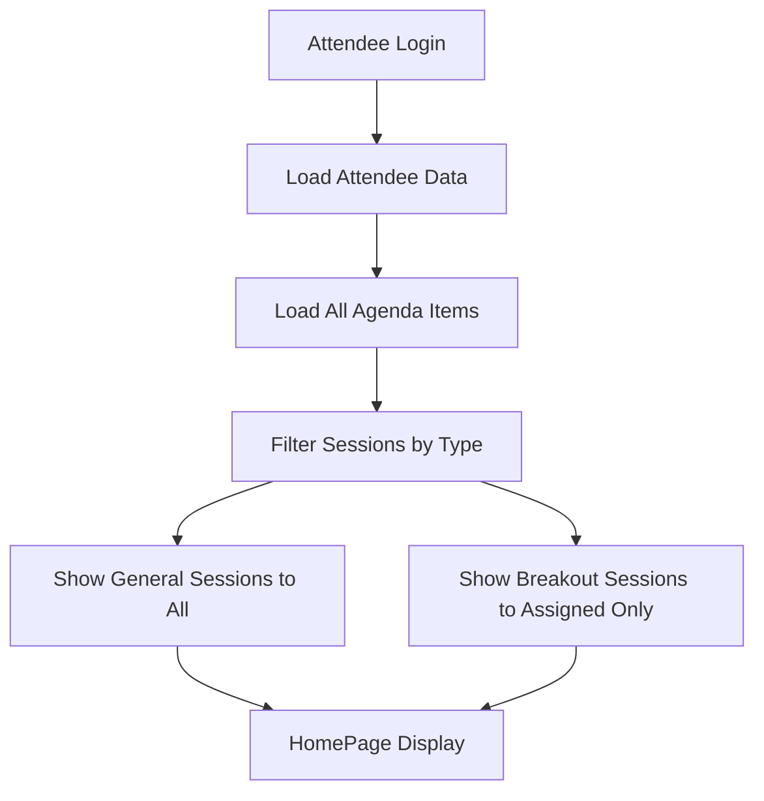

# Session Filtering Architecture

**Version:** 1.0  
**Last Updated:** 2025-01-16  
**Status:** ACTIVE - Core Business Logic  

## Overview

This document defines the **session filtering architecture** for the Knowledge Now React application, specifically how attendees see different types of sessions based on their assignments and the session types.

## ⚠️ CRITICAL: Session Type-Based Filtering

### **Session Types**

The application distinguishes between two main categories of sessions:

1. **General Sessions** - Visible to ALL attendees
   - `keynote` - Keynote presentations
   - `executive-presentation` - Executive presentations  
   - `panel-discussion` - Panel discussions
   - `meal` - Meals and dining events
   - `reception` - Reception events
   - `networking` - Networking sessions

2. **Breakout Sessions** - Visible ONLY to assigned attendees
   - `breakout-session` - Breakout sessions with limited capacity

### **Attendee Data Model**

```typescript
interface Attendee {
  id: string;
  // ... other fields
  selected_breakouts: string[]; // Array of breakout session IDs
  // ❌ selected_agenda_items: DOES NOT EXIST - This was the bug
}
```

## Session Filtering Logic

### **Core Filtering Algorithm**

```typescript
const filterSessionsForAttendee = (sessions: AgendaItem[], attendee: Attendee): AgendaItem[] => {
  if (!attendee) {
    return sessions; // Return all sessions if no attendee data
  }
  
  return sessions.filter(session => {
    if (session.type === 'breakout-session') {
      // Only show breakout sessions if attendee is assigned to them
      return attendee.selected_breakouts?.includes(session.id) || false;
    } else {
      // Show all other session types to everyone
      return true;
    }
  });
};
```

### **Business Rules**

1. **All attendees see general sessions** (keynotes, meals, etc.)
2. **Only assigned attendees see breakout sessions** (based on `selected_breakouts` array)
3. **If attendee has no breakout assignments** → sees all general sessions only
4. **If breakout session ID doesn't exist** → gracefully handled (session not shown)

## Implementation Architecture

### **Data Flow**



### **Key Components**

1. **useSessionData Hook** - Manages session filtering logic
2. **filterSessionsForAttendee Function** - Core filtering algorithm
3. **HomePage Component** - Displays filtered sessions
4. **Conference Start Detection** - Uses all sessions (not filtered) for start date logic

## Critical Fix Applied

### **Previous Bug (FIXED)**

```typescript
// ❌ INCORRECT - This field doesn't exist
const filterSessionsForAttendee = (sessions, attendee) => {
  if (!attendee || !attendee.selected_agenda_items) {
    return sessions; // This was always true, causing all sessions to show
  }
  // ... rest of logic never executed
};
```

### **Corrected Implementation**

```typescript
// ✅ CORRECT - Uses proper data model
const filterSessionsForAttendee = (sessions, attendee) => {
  if (!attendee) {
    return sessions;
  }
  
  return sessions.filter(session => {
    if (session.type === 'breakout-session') {
      return attendee.selected_breakouts?.includes(session.id) || false;
    } else {
      return true; // Show all general sessions
    }
  });
};
```

## HomePage State Logic

### **Conference Start Detection**

```typescript
// Uses ALL sessions (not filtered) to determine if conference has started
const hasConferenceStarted = allSessions && allSessions.some(session => {
  if (!session.start_time || !session.date) return false;
  const sessionStart = new Date(`${session.date}T${session.start_time}`);
  const now = TimeService.getCurrentTime();
  return sessionStart < now;
});
```

### **Display States**

1. **Conference Not Started** - When `!hasConferenceStarted`
2. **No Sessions Assigned** - When `hasConferenceStarted` but no sessions for this attendee
3. **Between Sessions** - When conference started, attendee has sessions, but none are current/next
4. **Current/Next Sessions** - When attendee has active or upcoming sessions

## Testing Strategy

### **Unit Tests**

- ✅ Session filtering logic with different session types
- ✅ Breakout session assignment logic
- ✅ Edge cases (no breakout assignments, invalid IDs)

### **Integration Tests**

- ✅ useSessionData hook with real data
- ✅ HomePage state logic with filtered sessions
- ✅ Time override integration

### **Manual Testing**

- ✅ Attendee 629980 (no breakout assignments) shows "Conference Not Started"
- ✅ Attendees with breakout assignments see appropriate sessions
- ✅ Time override affects conference start detection

## Performance Considerations

- **Filtering happens client-side** - Small dataset, acceptable performance
- **Caching** - Sessions cached in localStorage for offline access
- **Real-time updates** - Auto-refresh every 5 minutes when online

## Security Considerations

- **Data isolation** - Attendees only see their assigned breakout sessions
- **Access control** - Breakout session visibility controlled by `selected_breakouts` array
- **No data leakage** - General sessions visible to all (by design)

## Future Enhancements

1. **Server-side filtering** - Move filtering to API for better performance
2. **Dynamic session types** - Support for new session types without code changes
3. **Advanced assignments** - Support for multiple breakout session assignments
4. **Session conflicts** - Handle overlapping session assignments

---

**Architecture Status:** ✅ **VALIDATED**  
**Implementation Status:** ✅ **PRODUCTION READY**  
**Last Validated:** 2025-01-16
