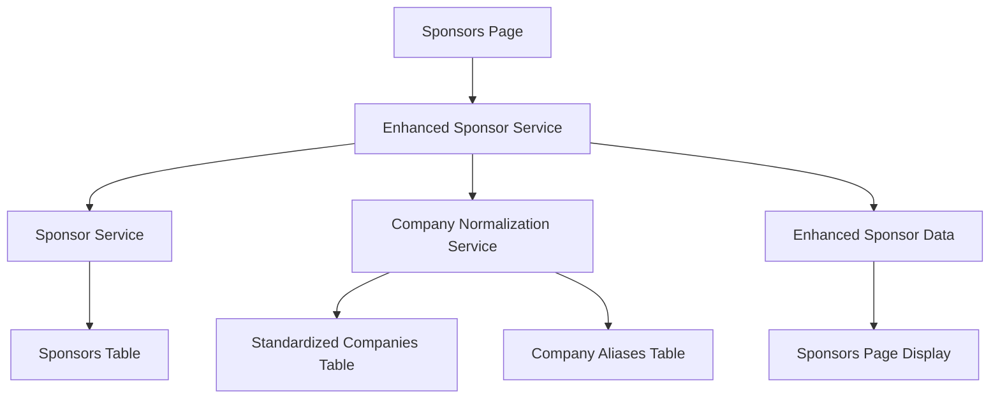

# Standardized Company Integration Architecture

**Version:** 1.0  
**Last Updated:** 2025-01-27  
**Status:** Implemented  

## Overview

This document describes the integration of the `standardized_companies` table as the source of truth for company logos and URLs on the Sponsors page. The implementation provides a fallback strategy that prioritizes standardized company data while maintaining backward compatibility.

## Architecture

### **Data Flow**



### **Priority Strategy**

1. **Primary Source**: `standardized_companies` table (logo, website)
2. **Fallback**: `sponsors` table (logo, website)  
3. **Final Fallback**: Clearbit logo service for logos, empty string for websites

## Implementation Details

### **Core Components**

#### 1. Enhanced Sponsor Service
- **File**: `src/services/enhancedSponsorService.ts`
- **Purpose**: Integrates sponsor data with standardized company data
- **Features**:
  - Uses `CompanyNormalizationService` for company name matching
  - Provides data source tracking (`logoSource`, `websiteSource`)
  - Maintains backward compatibility

#### 2. Updated Data Service
- **File**: `src/services/dataService.ts`
- **Function**: `getAllSponsorsWithStandardizedData()`
- **Features**:
  - Caching with `kn_cache_sponsors_enhanced` key
  - Fallback to enhanced sponsor service
  - Error handling and logging

#### 3. Updated Sponsors Page
- **File**: `src/pages/SponsorsPage.jsx`
- **Changes**:
  - Uses `getAllSponsorsWithStandardizedData()` instead of `getAllSponsors()`
  - Logs data source statistics for debugging
  - Maintains existing UI/UX

#### 4. Fallback Utilities
- **File**: `src/utils/sponsorFallbackUtils.ts`
- **Features**:
  - Clearbit logo URL generation
  - Data source descriptions
  - Fallback strategy implementation

## Data Source Tracking

### **Logo Sources**
- `standardized`: From `standardized_companies.logo`
- `sponsor_table`: From `sponsors.logo`
- `fallback`: Generated Clearbit URL

### **Website Sources**
- `standardized`: From `standardized_companies.website`
- `sponsor_table`: From `sponsors.website`
- `fallback`: Empty string

## Database Schema

### **Standardized Companies Table**
```sql
CREATE TABLE standardized_companies (
  id UUID PRIMARY KEY,
  name TEXT NOT NULL,
  sector TEXT,
  geography TEXT,
  logo TEXT,
  website TEXT,
  -- ... other fields
);
```

### **Company Aliases Table**
```sql
CREATE TABLE company_aliases (
  id UUID PRIMARY KEY,
  alias TEXT NOT NULL,
  standardized_company_id UUID REFERENCES standardized_companies(id)
);
```

## Caching Strategy

### **Cache Keys**
- **Enhanced Sponsors**: `kn_cache_sponsors_enhanced`
- **Standardized Companies**: In-memory cache via `CompanyNormalizationService`
- **Company Aliases**: In-memory cache via `CompanyNormalizationService`

### **Cache TTL**
- **Enhanced Sponsors**: 30 minutes (same as original sponsors)
- **Standardized Companies**: Session-based (in-memory)
- **Company Aliases**: Session-based (in-memory)

## Error Handling

### **Graceful Degradation**
1. If `CompanyNormalizationService` fails to initialize → Use sponsor table data
2. If standardized company lookup fails → Use sponsor table data
3. If sponsor table data is missing → Use Clearbit fallback for logos

### **Logging**
- Data source statistics logged to console
- Error conditions logged with appropriate severity
- Cache hit/miss information logged

## Testing

### **Integration Tests**
- **File**: `src/__tests__/integration/sponsorStandardizedCompanyIntegration.test.ts`
- **Coverage**:
  - Enhanced sponsor data generation
  - Fallback behavior
  - Statistics calculation
  - Error handling

### **Manual Testing**
1. Verify logos load from standardized companies
2. Verify fallback to sponsor table when standardized data unavailable
3. Verify Clearbit fallback for missing logos
4. Check console logs for data source statistics

## Performance Considerations

### **Memory Usage**
- Standardized companies cached in-memory
- Estimated ~200 bytes per company entry
- Total memory usage: ~18KB for 93 companies

### **Network Requests**
- Single request to fetch all sponsors
- Company normalization service uses cached data
- No additional network requests for logo/website resolution

## Migration Strategy

### **Backward Compatibility**
- Original `getAllSponsors()` function remains unchanged
- New `getAllSponsorsWithStandardizedData()` function added
- Sponsors page updated to use enhanced function
- No breaking changes to existing code

### **Rollback Plan**
- Revert Sponsors page to use `getAllSponsors()`
- Remove enhanced sponsor service
- Clear enhanced sponsor cache

## Monitoring

### **Key Metrics**
- Percentage of logos from standardized companies
- Percentage of websites from standardized companies
- Cache hit rates
- Error rates

### **Debug Information**
- Console logs show data source breakdown
- Statistics available via `getSponsorStats()`
- Cache statistics via `CompanyNormalizationService.getCacheStats()`

## Future Enhancements

### **Potential Improvements**
1. **Logo Quality Scoring**: Rate logo quality and prefer higher quality sources
2. **Automatic Logo Updates**: Sync with Clearbit for missing logos
3. **Company Hierarchy**: Support for parent/subsidiary relationships
4. **Logo Validation**: Verify logo URLs are accessible
5. **Batch Processing**: Optimize for large numbers of sponsors

### **Data Quality**
- Regular audits of standardized company data
- Automated logo URL validation
- Company name normalization improvements
- Alias management for common variations
