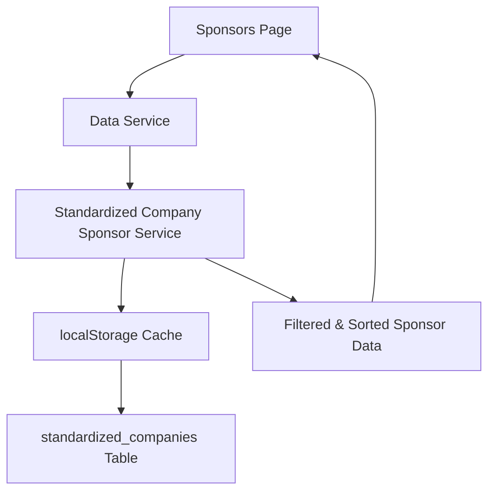

# Standardized Company Integration Architecture

**Version:** 2.0  
**Last Updated:** 2025-01-27  
**Status:** Implemented  
**Migration Status:** Complete - Sponsors table deprecated

## Overview

This document describes the complete migration from the `sponsors` table to the `standardized_companies` table as the single source of truth for all sponsor information. Sponsors are now identified by `fund_analytics_category === "Sponsors & Vendors"` and displayed in alphabetical order.

## Architecture

### **Data Flow**



### **Key Changes from v1.0**

1. **Deprecated**: `sponsors` table, `enhancedSponsorService`, `sponsorService`
2. **New Service**: `standardizedCompanySponsorService.ts` - single source of truth
3. **Filtering**: Sponsors identified by `fund_analytics_category === "Sponsors & Vendors"`
4. **Sorting**: Alphabetical by company name (no display_order field)
5. **Active Status**: All companies with sponsor category are active
6. **Caching**: Uses `kn_cache_standardized_companies` (synced during login)

## Implementation Details

### **Core Components**

#### 1. Standardized Company Sponsor Service
- **File**: `src/services/standardizedCompanySponsorService.ts`
- **Purpose**: Fetch and filter sponsors from standardized_companies table
- **Key Methods**:
  - `getSponsors()`: Returns all active sponsors, sorted alphabetically
  - `getSponsorByName(name)`: Find specific sponsor by name
  - `getSponsorsCount()`: Get total sponsor count
- **Features**:
  - Reads from localStorage cache (`kn_cache_standardized_companies`)
  - Filters by `fund_analytics_category === "Sponsors & Vendors"`
  - Sorts alphabetically by company name
  - Graceful degradation (returns empty array on errors)

#### 2. Updated Data Service
- **File**: `src/services/dataService.ts`
- **Function**: `getSponsorsFromStandardizedCompanies()`
- **Features**:
  - Wrapper for standardizedCompanySponsorService
  - Maintains consistent error handling
  - Deprecated: `getAllSponsors()` and `getAllSponsorsWithStandardizedData()`

#### 3. Updated Sponsors Page
- **File**: `src/pages/SponsorsPage.jsx`
- **Changes**:
  - Uses `getSponsorsFromStandardizedCompanies()` instead of old service
  - Expects `StandardizedCompany[]` type (not `Sponsor` or `EnhancedSponsor`)
  - Displays: name, logo, website, description from StandardizedCompany
  - No longer tracks `logoSource`/`websiteSource` (no longer needed)

#### 4. Company Normalization Service
- **File**: `src/services/companyNormalizationService.ts`
- **Changes**:
  - Now reads from localStorage cache first (`kn_cache_standardized_companies`, `kn_cache_company_aliases`)
  - Falls back to database if cache unavailable
  - Maintains in-memory maps for fast lookups
  - Used by other services for company name normalization

### **Configuration Updates**

#### Table Mappings
- **File**: `src/config/tableMappings.ts`
- **Added**: `standardized_companies`, `company_aliases`
- **Deprecated**: `sponsors` (marked for removal)

#### Server Data Sync Service
- **File**: `src/services/serverDataSyncService.ts`
- **Added**: `standardized_companies`, `company_aliases` to sync arrays
- **Removed**: `sponsors` from sync arrays

#### Cache Services
- **RobustDataService**: Registered `standardized_companies` service
- **CacheAsideService**: Added `standardized_companies` cache config
- **Cache Keys**: `kn_cache_standardized_companies`, `kn_cache_company_aliases`
- **TTL**: 1 hour for standardized companies

### **Deprecated Components**

All deprecated components have been marked with deprecation notices:

1. `src/services/sponsorService.ts` - Use standardizedCompanySponsorService instead
2. `src/services/enhancedSponsorService.ts` - Bridge solution no longer needed
3. `src/types/sponsor.ts` - Use StandardizedCompany type instead
4. `src/transformers/sponsorTransformer.ts` - No longer needed
5. `api/sponsors.js` - API endpoint no longer used
6. `/api/sponsors` endpoint in spike-server.js - Commented out

## Data Model

### **StandardizedCompany Interface**

```typescript
interface StandardizedCompany {
  id: string;
  name: string;
  logo: string;
  website: string;
  fund_analytics_category: string; // "Sponsors & Vendors" for sponsors
  sector: string;
  geography: string;
  description?: string;
  created_at: string;
  updated_at: string;
}
```

### **Sponsor Identification**

- **Filter**: `fund_analytics_category === "Sponsors & Vendors"`
- **Active Status**: All companies with sponsor category are considered active
- **Display Order**: Alphabetical by company name
- **No separate fields**: `is_active`, `display_order` not needed

## Caching Strategy

### **Login Sync**

1. User authenticates
2. `serverDataSyncService.syncAllData()` runs
3. Fetches `standardized_companies` and `company_aliases` from database
4. Caches to localStorage:
   - `kn_cache_standardized_companies`
   - `kn_cache_company_aliases`
5. Cache used by `standardizedCompanySponsorService` and `companyNormalizationService`

### **Cache Keys**

- **New**: `kn_cache_standardized_companies`, `kn_cache_company_aliases`
- **Deprecated**: `kn_cache_sponsors`, `kn_cache_sponsors_enhanced`

### **Cache TTL**

- **standardized_companies**: 1 hour
- **Invalidation**: Cleared on logout, force sync, or manual cache clear

## Testing

### **Test Coverage**

1. **Integration Tests**: `src/__tests__/integration/sponsorStandardizedCompanyIntegration.test.ts`
   - Tests filtering by fund_analytics_category
   - Tests alphabetical sorting
   - Tests cache handling
   - Tests edge cases (no sponsors, empty cache)

2. **Component Tests**: Updated to use standardized_companies
   - ForceSync.pwa.test.tsx
   - ForceSync.integration.test.tsx
   - LoginPage.integration.test.tsx
   - LoginPage.enhanced.test.tsx

3. **Mock Updates**: ServiceTestFactory.ts
   - Updated mocks to return `standardized_companies` instead of `sponsors`

## Rollback Strategy

### **Rollback Decision Points**

1. **Before merge to develop**: Delete feature branch
2. **After merge to develop**: Revert merge commit
3. **In production**: Create hotfix branch with revert

### **Rollback Procedure**

```bash
# If in feature branch (before merge)
git checkout develop
git branch -D feature/migrate-sponsors-to-standardized-companies

# If merged to develop (after merge)
git checkout develop
git revert <merge-commit-sha>
git push origin develop

# If in production (emergency)
git checkout main
git revert <merge-commit-sha>
git push origin main
```

### **Rollback Validation**

- Sponsors page loads with old implementation
- All 27 sponsors visible
- No console errors
- Cache keys restored to `kn_cache_sponsors`

## Deployment

### **Phase 1: Feature Branch Development** ✅ Complete

1. Create feature branch: `feature/migrate-sponsors-to-standardized-companies`
2. Implement all changes (Steps 1-15)
3. Update tests
4. Push to remote

### **Phase 2: Develop Environment Testing** (Next)

1. Merge PR to develop
2. Deploy to dev environment
3. Run full test suite
4. Manual QA testing
5. Performance validation
6. Soak test for 24-48 hours

### **Phase 3: Production Deployment** (If Approved)

1. Create PR from develop to main
2. Code review and approval
3. Merge to main
4. Deploy to production
5. Monitor for errors
6. Validate sponsors page in production

### **Phase 4: Post-Deployment Monitoring**

1. Monitor error rates (24 hours)
2. Check cache performance metrics
3. Review user feedback
4. Document lessons learned

## Performance Considerations

### **Expected Performance**

- **Page Load**: Within 10% of baseline (< 100ms difference)
- **Cache Hit Rate**: >= 95%
- **Memory Impact**: Minimal (in-memory maps for normalization)

### **Optimization Strategies**

1. **localStorage Cache**: Populated during login for fast access
2. **Alphabetical Sorting**: One-time sort on fetch, not on every render
3. **Filter Early**: Filter by category before sorting
4. **Graceful Degradation**: Empty array on errors, no blocking

## Future Enhancements

1. **Dynamic Categories**: Support multiple sponsor categories
2. **Custom Sorting**: Add optional sort fields (tier, sponsorship level)
3. **Enhanced Metadata**: Add sponsor tier, benefits, contact info
4. **API Endpoint**: Create `/api/standardized-companies` endpoint if needed
5. **Cache Warming**: Pre-populate cache before user needs it

## Related Documentation

- [Database Schema Changes](../database-schema-changes.md)
- [PWA Data Sync Service](../../../src/services/serverDataSyncService.ts)
- [Company Normalization Service](../../../src/services/companyNormalizationService.ts)
- [Migration Plan](../../../migrate-sponsors-to-standardized-companies.plan.md)

## Version History

### v2.0 (2025-01-27)
- Complete migration to standardized_companies table
- Deprecated sponsors table
- Implemented sponsor filtering by fund_analytics_category
- Alphabetical sorting
- Updated all services, tests, and documentation

### v1.0 (2025-01-27)
- Initial bridge implementation
- Enhanced sponsor service with standardized company data
- Maintained backward compatibility with sponsors table
