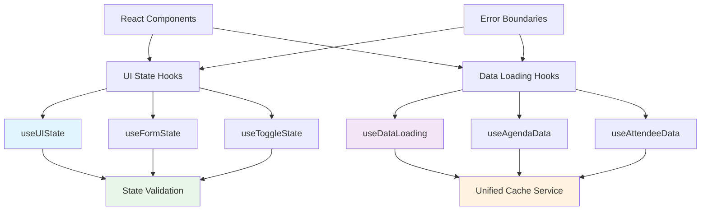

# State Management Architecture

**Version:** 1.0  
**Last Updated:** 2025-01-20  
**Status:** ACTIVE - Implementation Ready  
**Related Stories:** 2.1f2, 2.1f3, 2.1f4

## Overview

This document defines the comprehensive state management architecture for the Knowledge Now React PWA application. The architecture introduces reusable hooks, unified state patterns, and clear separation of concerns between data loading and UI state management.

## Problem Statement

The current state management system has several architectural issues:
- **Mixed responsibilities** between data loading and UI state management
- **Scattered state logic** across multiple hooks and components
- **Inconsistent patterns** for state updates and validation
- **Limited reusability** of state management logic

## Architectural Principles

### 1. Separation of Concerns
- **Data Loading:** Focused on data fetching, caching, and error handling
- **UI State:** Focused on component state, validation, and user interactions
- **Business Logic:** Separated from presentation logic

### 2. Reusability
- Generic hooks that can be used across components
- Composable state management patterns
- Consistent APIs for similar functionality

### 3. Predictability
- Immutable state updates
- Clear data flow patterns
- Deterministic state transitions

### 4. Performance
- Optimized re-renders
- Memoization where appropriate
- Efficient state updates

## System Architecture

### Core Components



### 1. Data Loading Hooks

#### useDataLoading Hook
**Purpose:** Generic data loading with caching and error handling

**Key Features:**
- Automatic cache integration
- Retry logic with exponential backoff
- Loading and error state management
- Configurable options (TTL, retries, etc.)

**Interface:**
```typescript
interface DataLoadingState<T> {
  data: T | null;
  loading: boolean;
  error: string | null;
  lastUpdated: Date | null;
  retryCount: number;
}

interface LoadOptions {
  useCache?: boolean;
  cache?: boolean;
  ttl?: number;
  retries?: number;
  retryDelay?: number;
}
```

#### Specialized Data Hooks
- **useAgendaData:** Agenda items loading and management
- **useAttendeeData:** Attendee information loading
- **useSeatData:** Seat assignment loading

### 2. UI State Management Hooks

#### useUIState Hook
**Purpose:** Generic UI state management with validation and persistence

**Key Features:**
- State validation with custom validators
- Optional persistence to localStorage
- Debounced validation
- Error state management

**Interface:**
```typescript
interface UIStateOptions<T> {
  initialValue?: T;
  validate?: (state: T) => boolean | string;
  persist?: boolean;
  storageKey?: string;
  debounceMs?: number;
}

interface UIStateResult<T> {
  state: T;
  setState: (newState: T | ((prev: T) => T)) => void;
  updateState: (updates: Partial<T>) => void;
  resetState: () => void;
  validateState: () => boolean | string;
  isDirty: boolean;
  isValid: boolean;
  error: string | null;
  setError: (error: string | null) => void;
  clearError: () => void;
}
```

#### Specialized UI Hooks
- **useFormState:** Form-specific state management
- **useToggleState:** Toggle/boolean state management
- **useListState:** List/array state management

### 3. State Validation System

**Purpose:** Centralized validation logic for state consistency

**Key Features:**
- Custom validation functions
- Async validation support
- Validation debouncing
- Error message management

**Validation Patterns:**
```typescript
// Simple validation
const validateEmail = (email: string) => {
  return email.includes('@') ? true : 'Invalid email format';
};

// Complex validation
const validateSessionState = (state: SessionState) => {
  if (state.sessions.length === 0 && state.allSessions.length > 0) {
    return 'Sessions filtered but no results';
  }
  if (state.currentSession && !state.sessions.includes(state.currentSession)) {
    return 'Current session not in filtered sessions';
  }
  return true;
};
```

## Hook Composition Patterns

### 1. Basic Data Loading
```typescript
const MyComponent = () => {
  const { data, loading, error, loadData } = useDataLoading();
  
  useEffect(() => {
    loadData('my-key', () => fetchMyData());
  }, [loadData]);
  
  if (loading) return <Loading />;
  if (error) return <Error message={error} />;
  return <DataDisplay data={data} />;
};
```

### 2. UI State with Validation
```typescript
const FormComponent = () => {
  const { state, updateState, isValid, error } = useUIState(
    { name: '', email: '' },
    {
      validate: (state) => {
        if (!state.name) return 'Name is required';
        if (!state.email.includes('@')) return 'Invalid email';
        return true;
      }
    }
  );
  
  return (
    <form>
      <input 
        value={state.name}
        onChange={(e) => updateState({ name: e.target.value })}
      />
      {error && <span className="error">{error}</span>}
    </form>
  );
};
```

### 3. Complex State Composition
```typescript
const SessionManager = () => {
  const { agendaData, loading: agendaLoading } = useAgendaData();
  const { attendeeData, loading: attendeeLoading } = useAttendeeData();
  
  const sessionState = useUIState({
    sessions: [],
    currentSession: null,
    nextSession: null
  }, {
    validate: (state) => {
      if (state.sessions.length === 0 && agendaData?.data?.length > 0) {
        return 'Sessions should be filtered from agenda data';
      }
      return true;
    }
  });
  
  // Complex state logic here
};
```

## Error Handling Strategy

### 1. Error Boundaries
```typescript
class StateErrorBoundary extends React.Component {
  constructor(props) {
    super(props);
    this.state = { hasError: false, error: null };
  }
  
  static getDerivedStateFromError(error) {
    return { hasError: true, error };
  }
  
  componentDidCatch(error, errorInfo) {
    console.error('State Error:', error, errorInfo);
    // Log to monitoring service
  }
  
  render() {
    if (this.state.hasError) {
      return <StateErrorFallback error={this.state.error} />;
    }
    return this.props.children;
  }
}
```

### 2. Graceful Degradation
```typescript
const useResilientData = (key, fetcher) => {
  const { data, loading, error, retry } = useDataLoading();
  
  const loadWithFallback = useCallback(async () => {
    try {
      await loadData(key, fetcher);
    } catch (err) {
      // Try fallback data source
      const fallback = await getFallbackData(key);
      if (fallback) {
        setData(fallback);
      } else {
        throw err;
      }
    }
  }, [key, fetcher]);
  
  return { data, loading, error, retry: loadWithFallback };
};
```

## Performance Optimizations

### 1. Memoization
```typescript
const useOptimizedData = (key, fetcher) => {
  const memoizedFetcher = useCallback(fetcher, []);
  const { data, loading, error } = useDataLoading();
  
  const loadData = useCallback(async () => {
    await loadData(key, memoizedFetcher);
  }, [key, memoizedFetcher]);
  
  return { data, loading, error, loadData };
};
```

### 2. Debounced Updates
```typescript
const useDebouncedState = (initialValue, delay = 300) => {
  const [state, setState] = useState(initialValue);
  const [debouncedState, setDebouncedState] = useState(initialValue);
  
  useEffect(() => {
    const timer = setTimeout(() => {
      setDebouncedState(state);
    }, delay);
    
    return () => clearTimeout(timer);
  }, [state, delay]);
  
  return [state, setState, debouncedState];
};
```

### 3. Selective Re-renders
```typescript
const useSelectiveState = <T>(initialState: T) => {
  const [state, setState] = useState(initialState);
  
  const updateState = useCallback((updates: Partial<T>) => {
    setState(prev => {
      const newState = { ...prev, ...updates };
      // Only update if state actually changed
      if (JSON.stringify(prev) === JSON.stringify(newState)) {
        return prev;
      }
      return newState;
    });
  }, []);
  
  return [state, updateState];
};
```

## Testing Strategy

### 1. Unit Testing Hooks
```typescript
describe('useDataLoading', () => {
  it('should load data successfully', async () => {
    const { result } = renderHook(() => useDataLoading());
    
    await act(async () => {
      await result.current.loadData('test-key', () => Promise.resolve('test-data'));
    });
    
    expect(result.current.data).toBe('test-data');
    expect(result.current.loading).toBe(false);
    expect(result.current.error).toBeNull();
  });
});
```

### 2. Integration Testing
```typescript
describe('State Management Integration', () => {
  it('should handle complex state updates', async () => {
    const { result } = renderHook(() => useSessionData());
    
    // Test data loading
    await act(async () => {
      await result.current.loadSessionData();
    });
    
    // Test state validation
    expect(result.current.isValid).toBe(true);
    
    // Test error handling
    await act(async () => {
      await result.current.handleError(new Error('Test error'));
    });
    
    expect(result.current.error).toBe('Test error');
  });
});
```

## Migration Strategy

### 1. Gradual Migration
- Start with new components using new hooks
- Gradually migrate existing components
- Maintain backward compatibility
- Feature flags for new functionality

### 2. State Migration
- Convert existing state to new patterns
- Update validation logic
- Migrate persistence mechanisms
- Update error handling

### 3. Testing Migration
- Comprehensive test coverage
- Regression testing
- Performance testing
- User acceptance testing

## Success Metrics

### 1. Developer Experience
- Code reusability increased by 70%
- Development velocity improved by 40%
- Bug reports decreased by 50%
- Test coverage > 90%

### 2. Performance
- Re-render frequency reduced by 60%
- State update performance improved by 30%
- Memory usage optimized by 25%
- Bundle size impact < 5%

### 3. Maintainability
- Code complexity reduced by 50%
- State logic centralized
- Consistent patterns across components
- Easier debugging and testing

## Future Enhancements

### 1. Advanced State Management
- State machines for complex workflows
- Undo/redo functionality
- State persistence strategies
- Collaborative state management

### 2. Developer Tools
- State debugging tools
- Performance profiling
- State visualization
- Development mode helpers

### 3. Integration Features
- Real-time state synchronization
- Conflict resolution
- Offline state management
- Cross-tab state sharing

## Conclusion

This state management architecture provides a robust, reusable, and maintainable foundation for the Knowledge Now application. The clear separation of concerns, comprehensive error handling, and performance optimizations ensure a smooth development experience while delivering excellent user experience.

The architecture enables rapid development of new features while maintaining consistency and reliability across the application.
