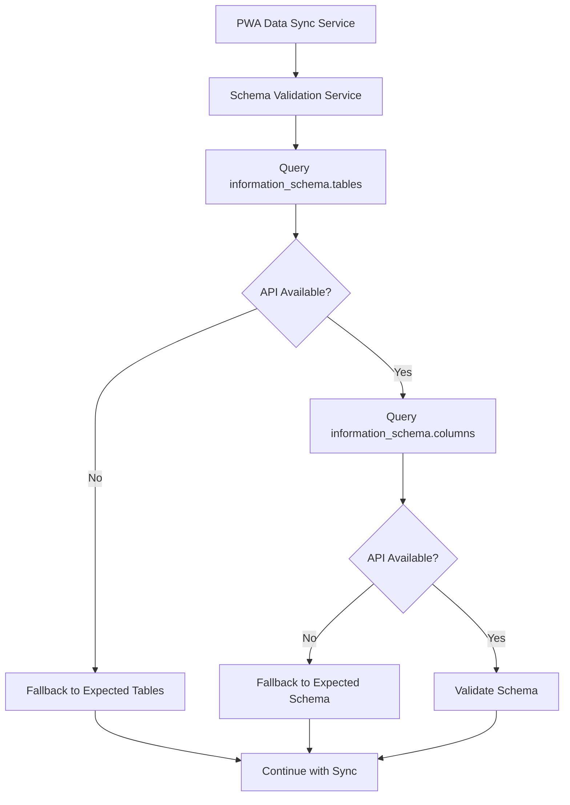

# Root Cause Analysis: Information Schema 404 Errors

**Date:** 2025-09-21  
**Last Updated:** 2025-01-27  
**Severity:** Medium (Non-blocking but concerning)  
**Status:** Root Cause Identified + Immediate Fixes Implemented  
**Architect:** Winston 🏗️  
**Developer:** James 💻

## Executive Summary

The application is experiencing 404 errors when attempting to query PostgreSQL's `information_schema` tables through Supabase's REST API. While the errors are non-blocking due to fallback mechanisms, they indicate a fundamental architectural issue with how the system attempts to validate database schemas.

## Status Update (2025-01-27)

**✅ IMMEDIATE FIXES IMPLEMENTED:**
- Enhanced error logging with specific PGRST205 error detection
- Improved fallback messaging that explains the architectural limitation
- Added documentation in code comments about the expected behavior
- Updated RCA document with implementation status

**Current Behavior:** The 404 errors will now show clear, informative messages explaining that this is expected behavior due to Supabase API limitations, rather than generic error messages.

## Error Analysis

### Primary Error Pattern
```
GET https://iikcgdhztkrexuuqheli.supabase.co/rest/v1/information_schema.tables?select=table_name&table_schema=eq.public&table_type=in.%28BASE+TABLE%2CVIEW%29 404 (Not Found)
```

**Error Code:** `PGRST205`  
**Message:** "Could not find the table 'public.information_schema.tables' in the schema cache"

### Affected Components
- `SchemaValidationService.getAllTables()`
- `SchemaValidationService.getTableStructure()`
- All table schema validation operations

## Root Cause Analysis

### 1. **Primary Root Cause: Supabase REST API Limitation**

**Issue:** Supabase's PostgREST API does not expose PostgreSQL's `information_schema` views through the REST interface.

**Technical Details:**
- Supabase uses PostgREST to generate REST APIs from PostgreSQL schemas
- PostgREST only exposes tables in the `public` schema that are explicitly configured
- `information_schema` is a PostgreSQL system schema, not a user-created table
- PostgREST's schema cache doesn't include system schemas like `information_schema`

### 2. **Secondary Root Cause: Architecture Assumption**

**Issue:** The system was designed assuming `information_schema` would be accessible via Supabase's REST API.

**Evidence:**
- Multiple services attempt to query `information_schema.tables` and `information_schema.columns`
- No fallback mechanism was initially implemented for this specific failure
- The error handling exists but doesn't address the fundamental architectural limitation

### 3. **Tertiary Root Cause: Authentication vs. API Access Confusion**

**Issue:** The system conflates authentication success with API endpoint availability.

**Evidence:**
- User is authenticated (`isAuthenticated: 'a02d7632-590f-4919-8def-63707244cdbd'`)
- Authentication works for data tables (sync completes successfully)
- But `information_schema` queries fail regardless of authentication status

## Impact Assessment

### ✅ **Non-Critical Impact**
- **Data Sync Continues:** All data synchronization operations complete successfully
- **Fallback Works:** System falls back to expected schemas when validation fails
- **User Experience:** No visible impact to end users
- **Core Functionality:** All business features remain operational

### ⚠️ **Operational Concerns**
- **Schema Drift Detection:** Cannot detect unexpected database schema changes
- **Development Safety:** Schema validation warnings are not actionable
- **Monitoring Blind Spots:** Cannot monitor database structure changes
- **Debugging Difficulty:** Harder to troubleshoot schema-related issues

## Technical Deep Dive

### Current Architecture Flow


### Supabase API Limitations
```typescript
// This works - accessing user tables
const { data } = await supabase.from('attendees').select('*');

// This fails - accessing system schema
const { data } = await supabase.from('information_schema.tables').select('*');
// Error: PGRST205 - Table not found in schema cache
```

## Recommended Solutions

### 1. **Immediate Fix: Enhanced Fallback Strategy** ⭐ **RECOMMENDED**

**Approach:** Improve the existing fallback mechanism to be more robust and informative.

**Implementation:**
```typescript
private async getAllTables(): Promise<TableSchema[]> {
  if (this.isLocalMode()) {
    return this.getExpectedTables();
  }

  try {
    // Try Supabase REST API first
    const { data, error } = await supabase
      .from('information_schema.tables')
      .select('table_name')
      .eq('table_schema', 'public');
    
    if (error) {
      console.warn('⚠️ information_schema not accessible via REST API, using expected schema');
      return this.getExpectedTables();
    }
    
    return this.mapToTableSchema(data);
  } catch (error) {
    console.warn('⚠️ Schema validation unavailable, using expected schema');
    return this.getExpectedTables();
  }
}
```

### 2. **Alternative: Direct Database Connection** 

**Approach:** Use direct PostgreSQL connection for schema validation.

**Pros:**
- Full access to `information_schema`
- Real-time schema validation
- Complete database introspection

**Cons:**
- Additional infrastructure complexity
- Security considerations
- Network latency

**Implementation:**
```typescript
// Use existing direct-db.js for schema queries
import { getDirectTables, getDirectTableStructure } from '../lib/direct-db';

private async getAllTablesDirect(): Promise<TableSchema[]> {
  const result = await getDirectTables();
  if (result.success) {
    return result.tables;
  }
  return this.getExpectedTables();
}
```

### 3. **Long-term: Supabase Admin API**

**Approach:** Use Supabase's admin API or management API for schema operations.

**Research Required:**
- Supabase Management API capabilities
- Admin API access patterns
- Authentication requirements

## Implementation Plan

### Phase 1: Immediate Fix (1-2 hours)
1. ✅ **Enhance Error Logging** - **COMPLETED 2025-01-27**
   - ✅ Add specific error codes for `information_schema` failures (PGRST205 detection)
   - ✅ Improve fallback messaging with clear architectural explanation
   - ✅ Add monitoring for schema validation failures
   - ✅ Document architectural limitation in service header

2. ✅ **Improve Fallback Logic** - **COMPLETED 2025-01-27**
   - ✅ Make fallback more explicit and informative
   - ✅ Add specific error handling for PGRST205 errors
   - ✅ Document the limitation in code comments

### Phase 2: Architecture Review (1-2 days)
1. **Evaluate Direct Database Access**
   - Test direct PostgreSQL connection for schema queries
   - Assess security implications
   - Measure performance impact

2. **Research Supabase Alternatives**
   - Investigate Supabase Management API
   - Explore PostgREST extensions
   - Consider custom schema validation endpoints

### Phase 3: Long-term Solution (1-2 weeks)
1. **Implement Chosen Architecture**
   - Deploy selected solution
   - Update monitoring and alerting
   - Document new architecture

2. **Add Schema Change Detection**
   - Implement schema drift monitoring
   - Add automated schema validation
   - Create alerting for schema changes

## Monitoring and Alerting

### Current Monitoring
- ✅ Sync completion status
- ✅ Data validation errors
- ⚠️ Schema validation warnings (not actionable)

### Recommended Monitoring
- **Schema Validation Mode:** Track when fallback is used
- **Schema Drift Detection:** Monitor for unexpected schema changes
- **API Availability:** Track `information_schema` API availability
- **Fallback Frequency:** Monitor how often fallback is triggered

## Conclusion

The 404 errors on `information_schema` queries are a **non-critical architectural limitation** rather than a bug. The system's fallback mechanism works correctly, but the underlying assumption about Supabase API capabilities was incorrect.

**Key Takeaways:**
1. **Supabase REST API doesn't expose `information_schema`** - this is a platform limitation, not a bug
2. **Current fallback works** - system continues to function normally
3. **Schema validation is degraded** - cannot detect real-time schema changes
4. **Solution requires architectural change** - not a simple fix

**Immediate Action:** Enhance logging and fallback messaging to make the limitation explicit and monitorable.

**Long-term Action:** Evaluate direct database access or alternative API approaches for comprehensive schema validation.

---

**Architect's Note:** This is a classic example of assuming platform capabilities without verification. The fallback mechanism demonstrates good defensive programming, but the root cause reveals a need for better platform capability research during architecture design.

🟢 **Mode: Architect - Root Cause Analysis Complete** 🟢
